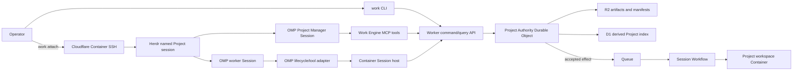

# 0001 — Cloudflare Herdr + OMP tracer

## Contract

Build one real software-change journey that proves Work Engine's semantic kernel, Cloudflare authority boundary, disposable execution, and terminal-first operator experience.

**Success:** an operator attaches to a Cloudflare-hosted Herdr Project workspace, asks an OMP Project Manager to perform bounded Work, observes a separate OMP worker produce verified Evidence and a revision-bound Proposal, directly approves it, and sees an authorized Merge advance Canonical Project State.

**Not success:** a chat demo, a task list, an agent assertion of completion, a local-only simulation, or a terminal whose process state is treated as Project truth.

### Source inputs

| Source | Role | SHA-256 |
| --- | --- | --- |
| `/home/nori/Downloads/Project Agent Runtime(1).md` | North-star vision and constitution | `4453ffe39c9345c2071514fcc2457291d796872cc794b96dd0665be8fb32ed89` |
| `/home/nori/Downloads/Project Agent Runtime.md` | Draft v0.5 ontology and semantic laws | `fc8e68a5bf3279b404d8c477ece2f6d9c7f6efc8a596e84d93535f2c5b1bd049` |

The initial scaffold imports those exact inputs into the repository and records their provenance. The repository copies then become canonical; the download paths remain provenance only.

## Goal, constraints, and values

### Goal

Prove the smallest complete path from intended Work to governed authoritative change while the Project survives every participating Session and container process.

### Constraints

- Host the first deployed path on Cloudflare products.
- Use OMP when technically possible; pin `omp/17.2.3` for this tracer.
- Reuse Herdr as the operator and terminal surface; build no custom web frontend.
- Keep domain semantics independent of Cloudflare, OMP, Herdr, model providers, and memory systems.
- Use TypeScript 7, Bun, Effect v4, Oxfmt, Oxlint, the Effect Oxlint plugin, and Alchemy v2.
- Treat Workgraph as design prior art only until its license or transfer authority is resolved.
- Treat Hindsight as optional cognition, never coordination authority; it is outside tracer 0001.
- Require operator authority before deployment, credential changes, or external repository mutation.

### Values

1. Correctness by construction over retrospective reconciliation.
2. One semantic authority for each mutable fact.
3. Explicit core-to-derivation edges.
4. Work before workers.
5. Evidence before claims.
6. Replaceable agents, harnesses, memory, infrastructure, and interfaces.

## Invariants

All enforcers are planned until implementation is accepted.

| ID | Contract | Planned enforcer |
| --- | --- | --- |
| `WE-001` | One Project authority serializes accepted mutable Project facts. | Pure kernel transition API + Project Durable Object transaction tests |
| `WE-002` | Work identity and lifecycle do not depend on Agent Profile or Session identity. | Kernel types and transition laws |
| `WE-003` | A Session is one bounded attempt; every retry creates a new Session. | Session constructor + retry property tests |
| `WE-004` | Handoffs, Evidence, artifacts, and Proposals are durable but not authoritative Project change. | Distinct protocol types; no transition path except Merge |
| `WE-005` | Merge requires revision compatibility, satisfied Gates, applicable Policy, and a scoped Grant. | Total Merge decision function |
| `WE-006` | Instructions and model-selected arguments never grant authority. | Actor-bound capability tokens outside agent input |
| `WE-007` | Every derived view carries the canonical revision or source digest that warrants it. | Projection types + drift tests |
| `WE-008` | Herdr metadata, panes, transcripts, and process state are disposable projections. | Dependency boundary; no Herdr import in kernel or Project storage |
| `WE-009` | Container loss cannot erase accepted Project state or promote partial output. | Durable Object/R2 boundary + interruption acceptance test |
| `WE-010` | Duplicate commands and deliveries are idempotent by stable identity. | Durable command receipts |
| `WE-011` | Concurrent mutation uses distinct Workspace Views or explicit serialization. | Resource claims + admission policy |
| `WE-012` | Human approval, check Evidence, and agent assertions remain different evidence kinds. | Disjoint schemas and Gate predicates |
| `WE-013` | No unlicensed Workgraph source enters the repository. | Dependency/source audit |

### Minimal semantic inventory

| Object | Required tracer identity and relations |
| --- | --- |
| Project | stable `projectId`, monotonic `eventRevision`, Merge-only `contentRevision`, current Policy reference |
| Work | stable `workId`, Project, objective, Work Kind, Work Process, lifecycle |
| Work Process | stable process identity, Work, dependencies, Resource requirements, required Gates |
| Agent Profile | stable profile identity, role, OMP harness reference, instruction/skill references, model policy |
| Session | unique `sessionId`, Work, Profile, attempt number, predecessor attempt, finite Context reference, deadline, status |
| Workspace View | stable view identity, Project basis `contentRevision`, content manifest, writable scope, lease |
| Resource Claim | Resource identity, read/write mode, owner Session, validity interval |
| Handoff | producer and intended consumer, basis event/content revisions, payload reference, provenance |
| Evidence | Evidence Kind/Role, exact subject, producer, observation time, payload digest, limitations |
| Proposal | proposer, immutable submission event revision, basis content revision, candidate artifact/events, supporting Evidence |
| Gate | deterministic predicate and required Evidence/approval roles; satisfaction is derived |
| Grant | subject actor, capability, scope, validity, granting authority |
| Policy | stable identity and revision, admission/transition/authority rules |
| Merge Receipt | Proposal, actor, evaluated Policy/Gates/Grant, prior/resulting event and content revisions |

`History` and operator status are derived projections of accepted events. `Canonical State` is the logical composition of accepted authoritative facts, not a second stored entity with an independent writer.

## User journey

1. The operator runs `work project create` against a deployed preview and receives a Project identity plus event/content revisions.
2. The operator submits one fixture Work item—repair a deliberately failing behavior and run its named verification command—and receives its Work identity.
3. The operator runs `work attach <project-id> --work <work-id>`.
4. `work attach` requests a bounded Project Manager Session for that Work and Profile. The Project authority creates its identity and effect request; Work Engine starts or leases the Project workspace Container and resolves its running instance ID.
5. The pinned local Herdr thin client attaches through Cloudflare's SSH `ProxyCommand` and presents that registered OMP Project Manager Session with a finite Project observation and scoped tools.
6. The operator asks the manager to execute the Work. The manager calls Work Engine's typed `start_session` capability; it does not start an unregistered process directly.
7. The Project authority creates a new Session identity, accepts the attempt, reserves the Workspace Resource, and durably emits an idempotent effect request. A Queue consumer starts the deterministically named Session Workflow, which instructs the container-side Session host to materialize an isolated worktree and start an OMP worker in a Herdr tab under a distinct UID.
8. The worker changes the fixture, may run the named check for feedback, calls the scoped `candidate.finalize` MCP tool, and exits. Its check is not Gate Evidence.
9. The trusted Session host revokes workspace write access, validates changed paths, creates a read-only snapshot, runs the exact named check against it, uploads content-addressed artifacts, and dispatches Evidence/Proposal commands under the host actor while recording the worker Session as producer/proposer.
10. The Session host records the terminal disposition and durable Handoff. A Proposal does not satisfy the completion Gate until `SessionCompleted` is accepted.
11. Work Engine evaluates deterministic Gates. The manager may explain the result but cannot approve or Merge with its agent-scoped Grant.
12. The operator reviews the exact patch and Evidence in Herdr, then uses the separately authenticated local `work approve` command; no human credential or authority command executes in the Container.
13. The operator's local `work merge` submits the scoped Merge Grant. The Project authority atomically rechecks the content revision, Gates, Policy, and Grant before advancing Canonical State.
14. `work status` and Herdr display metadata show the accepted result and its complete Work → Session → Evidence → Proposal → Handoff → Gate → Grant → Merge chain.

## Semantic topology



**Reading:** commands flow toward the Project authority; execution and terminal state return only observations and candidate outputs. Only Merge changes Canonical State.

## Ownership and authority

| Component | Owns | Must not own |
| --- | --- | --- |
| Pure kernel | admissible transitions and deterministic derivations | I/O, time, credentials, provider state |
| Project Authority Durable Object | canonical Project event/content revisions, accepted events, Work, Resource claims, Policy, Gates, Grants, Merge receipts | artifact bytes, terminal process state, model memory |
| R2 | content-addressed artifacts, Handoffs, Evidence payloads, workspace manifests, session exports | mutable Project authority |
| D1 | cross-Project discovery and query projections | independently writable Project facts |
| Queue and Session Workflow | at-least-once effect delivery, durable attempt supervision, bounded retries and waits | Project facts, Gate or Merge decisions |
| Project workspace Container | disposable filesystem, Herdr server, OMP processes, local worktrees | accepted Project truth |
| Herdr | terminal topology, lifecycle observations, display metadata | Work, Gate, Grant, Proposal, or Merge semantics |
| OMP Project Manager | bounded coordination attempt through scoped capabilities | approval identity, Merge authority, hidden policy |
| OMP worker | bounded implementation attempt in one Workspace View | Project authority or sibling Workspace mutation |
| `work` CLI/MCP | decoded command/query transport with actor binding | policy decisions or local shadow state |

Tracer 0001 deliberately places all accepted mutable Project facts in one Project Durable Object. This is a deployment specialization, not an ontology claim that every future Project must map to one runtime object. Artifact bytes remain under R2 custody; their accepted references remain Project facts. A future distributed authority layout must still assign exactly one authority to each mutable fact.

## Command and transition contract

### Identity and encoding

- IDs are lowercase type-prefixed UUIDv4 values generated by trusted code with Web Crypto: `prj_`, `wrk_`, `wpr_`, `prf_`, `ses_`, `wsv_`, `res_`, `hnd_`, `evd_`, `prp_`, `gat_`, `grt_`, `pol_`, `mrg_`, `cmd_`, and `efx_`.
- `eventRevision` and attempt numbers are non-negative JSON safe integers. `eventRevision` increments once per accepted command transaction, not once per emitted event. `contentRevision` starts at `0` and increments only when Merge accepts a new canonical content manifest.
- Times are trusted UTC RFC 3339 strings with millisecond precision.
- Digests are lowercase `sha256:<64 hex>` strings.
- Persistent structured values are Effect-Schema-encoded JSON, canonicalized with RFC 8785 JSON Canonicalization Scheme, then hashed with Web Crypto SHA-256.
- Every schema uses an exact tagged union and rejects unknown fields.

### Envelope and result

`CreateProjectRequest` contains `schemaVersion: "work-engine/v1"`, `commandId`, and a `CreateProject` payload; trusted authority creates `projectId` at acceptance. Every later `CommandEnvelope` also contains `projectId` and `expectedRevision`, meaning the expected Project `eventRevision`. The authenticated transport attaches `actorId`, actor kind, and presented Grant references after decoding. Client- or model-selected actor identity is never trusted.

The internal command envelope is:

```ts
type CommandEnvelope = {
  readonly schemaVersion: \"work-engine/v1\";
  readonly commandId: CommandId;
  readonly projectId: ProjectId;
  readonly expectedRevision: ProjectRevision;
  readonly actor: AuthenticatedActor;
  readonly command: ProjectCommand;
};
```

The Project authority returns exactly one:

- `Accepted { eventRevision, eventIds, effectRequests }`;
- `Rejected { eventRevision, code, details }`;
- `AlreadyApplied { originalReceipt }`.

Rejection codes are a closed union: `project_not_found`, `revision_mismatch`, `unauthorized`, `invalid_transition`, `resource_conflict`, `gate_unsatisfied`, `policy_rejected`, `proposal_stale`, `lease_expired`, and `artifact_missing`. Decode/authentication failures occur before Project dispatch and use separate HTTP errors.

Tracer commands are a closed union:

```text
CreateProject · SubmitWork
OpenManagerSession · StartWorkerSession · CancelSession
ReportSessionStarted · ReportSessionTerminal
RecordHandoff · RecordEvidence · SubmitProposal
ApproveProposal · RejectProposal · MergeProposal
AcquireWorkspaceLease · RenewWorkspaceLease · ReleaseWorkspaceLease
```

Effects begin only after accepted events, the command receipt, and any effect request are durable in one Project Durable Object transaction. Queue publication follows an outbox: persist → publish with `effectId` → record dispatch receipt; an alarm retries an unrecorded publication. Queue acknowledgement follows a stored Workflow-start receipt.

### Tracer transition spine

```text
ProjectCreated
→ WorkSubmitted
→ SessionRequested
→ SessionStarted
  ├→ SessionCancellationRequested → SessionInterrupted(cancelled) → HandoffRecorded
  ├→ SessionFailed | SessionInterrupted → HandoffRecorded
  └→ EvidenceRecorded
     → ProposalSubmitted
     → SessionCompleted
     → HandoffRecorded
     → GatesEvaluated
     → ApprovalRecorded | ProposalRejected
     → ProposalMerged
```

`ProposalMerged` is the only event in this tracer that promotes a candidate workspace result into accepted Project state.

### Grants and Gates

| Actor | Granted tracer capabilities | Explicitly absent |
| --- | --- | --- |
| operator | `project.create`, `work.submit`, `manager.open`, `session.cancel`, `proposal.read`, `proposal.approve`, `proposal.reject`, `proposal.merge` | infrastructure mutation and external Git/deploy effects |
| Project Manager Session | `project.read`, `work.read`, `worker.start`, `session.cancel`, `evidence.read`, `proposal.read` | `proposal.approve`, `proposal.merge` |
| worker Session | scoped `project.read`, `workspace.read`, `workspace.write`, and local `candidate.finalize` request for its own Session/Work | sibling Workspace access, Project command dispatch, Session creation, approval, Merge |
| Session Workflow | `workspace.lease`, `session.dispatch`, `session.cancel.execute` for its accepted `effectId` | Proposal, Gate, Grant, Policy, or Merge mutation |
| Session host | `session.started`, `session.terminal`, `artifact.put`, `evidence.record`, `proposal.submit`, `handoff.record`, `workspace.heartbeat` for hosted Sessions | Work creation, approval, Merge |
Tracer Policy `pol_tracer_0001_v1` permits Merge only when the Proposal `basisContentRevision` equals the current Project `contentRevision`, the merger is not the Proposal-producing Session, the Merge Grant is valid for that Project/Proposal, and all five Gates are satisfied:

1. `gat_session_completed` — machine Session-terminal Evidence says `completed`.
2. `gat_candidate_present` — the Proposal candidate digest resolves to an immutable R2 artifact manifest.
3. `gat_scope_valid` — the host-owned snapshot Evidence proves the changed-path set is exactly within the Work's writable scope.
4. `gat_check_passed` — host-executed machine-check Evidence records the exact required command, exit code `0`, and the same frozen candidate digest.
5. `gat_human_approved` — a human approval references the immutable Proposal identity, its submission event revision, and candidate digest.

Gate satisfaction is a pure derivation. `GatesEvaluated` records the evaluated Policy/Gate revisions and source Evidence IDs; it is not an independently editable boolean.

### Frozen cross-batch seam

`packages/protocol` owns the schemas used by every implementation batch. `packages/runtime` owns these platform-free service interfaces:

```ts
interface ProjectAuthority {
  dispatch(command: CommandEnvelope): Effect<CommandResult, ProjectAuthorityError>;
  observe(projectId: ProjectId, eventRevision?: EventRevision): Effect<ProjectObservation, ProjectAuthorityError>;
}

interface ArtifactStore {
  put(content: Uint8Array, mediaType: string): Effect<ArtifactReceipt, ArtifactError>;
  get(digest: Sha256Digest): Effect<Uint8Array, ArtifactError>;
  head(digest: Sha256Digest): Effect<ArtifactReceipt, ArtifactError>;
}

interface SessionHost {
  ensureReady(lease: WorkspaceLease): Effect<WorkspaceReady, SessionHostError>;
  start(spec: SessionStartSpec): Effect<SessionHostReceipt, SessionHostError>;
  cancel(sessionId: SessionId, reason: string): Effect<SessionHostReceipt, SessionHostError>;
}
```

`SessionHost.start` is idempotent on `(sessionId, effectId)`: it persists the start claim before process creation and returns the same receipt on duplicate calls. The Queue consumer derives the Workflow instance ID exactly from `effectId`; creation with an existing ID attaches to the existing Workflow. A crash after process creation is reconciled from the persisted host claim and never spawns a second OMP process for that Session.

The public Worker surface is versioned and minimal:

```text
POST /v1/projects
POST /v1/projects/:projectId/commands
GET  /v1/projects/:projectId/observations/current
GET  /v1/projects/:projectId/artifacts/:digest
POST /v1/projects/:projectId/attach-resolutions
POST /v1/sessions/:sessionId/model/chat/completions
GET  /v1/projects/:projectId/attach-resolutions/:resolutionId
```

Every query route requires an authenticated actor and a current Project-scoped read capability. Artifact reads additionally require that the digest is referenced by an accepted event visible to that actor; a bearer token cannot enumerate another Project or bypass the MCP projection.

MCP tools and the CLI map to these schemas; they do not define parallel payloads. Workflow-to-Container calls use the typed `SessionHost` contract through a Cloudflare binding. Host callbacks dispatch the same command envelopes under a host-scoped service actor.

The `cloud-runtime`, `session-host`, and `terminal-client` batches may begin in parallel only after these exported schemas and interfaces are committed and their contract tests pass.

## Execution and liveness

### Container lease

- The accepted `OpenManagerSession` effect starts a Session Workflow. It calls `SessionHost.ensureReady`, which starts a stopped Container and waits for a health response proving the pinned Herdr/OMP versions, OMP integration, `work` tools, and model proxy are ready.
- Readiness must succeed within 60 seconds. Failure records `SessionFailed { reason: "workspace_unavailable" }`, releases the lease, and returns no attach resolution.
- A ready host returns `WorkspaceReady { instanceId, containerGeneration, imageDigest, readyAt }`. `containerGeneration` changes whenever the disposable VM changes.
- The Project authority records a five-minute attach resolution bound to Project, manager Session, Container generation, instance ID, and authorized SSH-key name. It is routing data, not an SSH credential.
- The operator-authenticated local CLI fetches that resolution, creates a temporary SSH configuration, verifies plain SSH through Wrangler account authentication plus the authorized key, then starts `herdr --remote`. An expired resolution, replaced generation, or failed probe requires a fresh resolution; the CLI never reuses a stale instance ID.
- Authorized `ssh-ed25519` public keys are operator-approved Alchemy inputs. No key is added by an agent or runtime command.
- Cloudflare SSH itself does not keep the Container alive. While an operator or Session lease exists, the adapter renews activity every 30 seconds. A lease becomes stale after 90 seconds without a heartbeat.

### Bounded defaults

| Bound | Tracer value |
| --- | --- |
| manager Session deadline | 30 minutes |
| worker Session deadline | 10 minutes |
| worker attempts per Work | 2 total: initial plus one Policy-authorized retry |
| worker model output budget | 32,000 generated tokens |
| worker tool-call budget | 100 calls |
| captured Session output | 10 MiB |
| Queue deliveries | 3 total for one stable `effectId`; `max_retries = 2`, 10-second delay, then dead-letter Queue |
| Workflow side-effect attempts | 3 total; 10-second initial delay and exponential backoff capped by Session deadline |
| Session-host dispatch timeout | 30 seconds |
| artifact upload/finalization | 60 seconds after worker termination |
| reconciliation cadence | one minute |

A Queue consumer acknowledges only after the Session Workflow start receipt is stored. Dead-letter handling records `dispatch_exhausted` and leaves the effect/attempt identities inspectable.

Transport or platform retries before `SessionStarted` reuse stable effect and Session identities and are idempotent. Once `SessionStarted` is accepted, an OMP/process failure terminates that Session; the one allowed Work retry creates a new Session identity. An accepted `CancelSession` emits one cancellation effect to the existing Workflow, which calls `SessionHost.cancel`; the host then reports `SessionInterrupted { reason: "cancelled" }`. The first accepted terminal event wins cancellation/completion races; later terminal reports are idempotent only when identical and otherwise rejected as `invalid_transition`.

### Session supervision

- Every Session carries its deadline, output limit, tool budget, Workspace Resource claim, stable `effectId`, and unique Linux UID in `SessionStartSpec`.
- The Project authority creates the Session identity. After acquiring the workspace lease and persisting the host start claim, the Session host reports `SessionStarted` before Herdr starts OMP.
- Herdr's OMP integration supplies lifecycle observations; the Work Engine OMP adapter supplies domain requests and Evidence capture. Every pane-process exit is reported; unexpected exit becomes `SessionInterrupted`.
- Herdr agent auto-resume is disabled. A process or Herdr restart never preserves Session identity; retry requires a new Session with an explicit causal reference to the failed attempt.
- The host records a durable Handoff from the accepted Session observations and artifact references at terminal state. A later manager Session receives that Handoff; it never receives reconstructed private cognition.
- A terminal Session event revokes Session/model credentials and releases its Resource claim idempotently. Workflow timeout or missed heartbeat drives the same revocation/release through reconciliation.
- Herdr layout after a container restart is derived from Project observations. Opaque Herdr state is not required for correctness.

### Workspace custody

- The fixture base is a content-addressed R2 manifest. Before each Session, the host materializes the exact Policy-selected base or retry Handoff manifest into one isolated Git worktree.
- Each Session runs under a distinct unprivileged Linux UID. Its home, worktree, and credentials are inaccessible to sibling Session UIDs; the trusted adapter/Herdr UID is separate.
- `candidate.finalize` records the worker's request and requires OMP to exit. The host then revokes write access, rejects any changed path outside `src/greeting.ts`, snapshots exact bytes to a host-owned read-only directory, runs `bun run check` there, and computes Evidence and Proposal digests from that same snapshot.
- The host persists the candidate Workspace View and terminal Handoff manifests to R2 before Proposal/terminal commands. Filesystem state between those named checkpoints is disposable and never authoritative.
- Arbitrary untrusted repositories require a stronger per-Session Sandbox boundary and are deferred.

### Storage ordering

There is no claimed distributed transaction across Durable Object storage, R2, D1, Queue, or Container state.

1. The Session host computes frozen artifact bytes and digest, writes R2 key `sha256/<hex>`, then verifies `head` returns the same digest and length.
2. R2 deletion is absent from all tracer Grants. A repeated put for the same digest is accepted only with the same length and metadata.
3. `RecordEvidence` is then dispatched under the host actor with the verified Artifact receipt and producer Session reference. The Project authority accepts only the host-scoped actor and an Artifact receipt resolvable through `ArtifactStore.head`.
4. `SubmitProposal` is dispatched under that host actor, records the worker Session as proposer, and may reference only accepted Evidence plus the exact frozen candidate manifest. The host never presents the worker credential.
5. `MergeProposal` atomically records evaluated Gate/Policy/Grant references, prior/resulting event revisions, prior/resulting content revisions, and accepted candidate digest in the Project Durable Object.
6. D1 projection runs after the accepted Project transaction and upserts by `(projectId, eventRevision)`. Projection failure leaves the canonical event pending for retry; it never rolls back or replaces Project truth.
7. On Container `SIGTERM`, the Session host stops accepting new work, flushes already-frozen pending artifacts, dispatches terminal Session/Handoff commands, and exits within Cloudflare's documented grace period; reconciliation handles an eventual `SIGKILL`.

## Failure behavior

| Failure | Required observation | Forbidden outcome |
| --- | --- | --- |
| Duplicate command or delivery | Return original receipt | duplicate Session or Merge |
| Stale expected event revision | Reject with observed/current event revisions | implicit command rebase or Merge |
| Failed named check | Preserve Evidence; Gate remains false | agent assertion satisfies Gate |
| Missing Merge Grant | Typed authority rejection | instruction treated as permission |
| Container or OMP loss | SessionInterrupted/Failed; partial evidence retained when available | silent continuation of same Session |
| Timeout or budget exhaustion | Typed terminal disposition | unbounded loop |
| Workspace conflict | reject, serialize, or allocate isolated Workspace | concurrent mutation of same Resource |
| Human rejection | historical Proposal remains; state unchanged | deletion or promotion |
| D1/R2 projection lag | canonical revision remains queryable from Project authority | derived store becomes authoritative fallback |
| Herdr state loss | reconstruct terminal projection from Project state | Project state reconstructed from terminal transcript |
| Container readiness, version, or SSH probe failure | manager Session fails with specific reason; no attach resolution | attach to an unknown or stale instance |
| Queue delivery exhaustion | Session fails as `dispatch_exhausted`; outbox/effect remains inspectable | dropped Work or unbounded retry |
| Model proxy/provider failure | Session fails as `model_unavailable`; usage/error Evidence retained | fabricated model completion |
| R2 upload or digest verification failure | Session fails as `artifact_unavailable`; no Proposal accepted | Proposal referring to missing bytes |
| Cancel/complete race | first accepted terminal event wins; conflicting later event rejected | two terminal states |

## Interface contract

There is no custom web frontend in tracer 0001.

### Operator commands

The terminal client exposes at least:

```text
work project create
work submit
work attach
work status
work session start
work session cancel
work evidence show
work proposal show
work approve
work reject
work merge
work why
```

Human-authority commands require an operator-bound credential unavailable to OMP processes. Agent MCP tools expose the same semantic commands under agent-scoped Grants, not a broader API.

`approve`, `reject`, and operator-authorized `merge` execute only from the operator's local `work` process after Cloudflare Access authentication. They are not exposed by the remote Project Manager's MCP server, and no operator credential is forwarded over SSH.

Every command supports `--json`. In JSON mode stdout is one tagged result envelope and progress goes to stderr. Exit codes are fixed: `0` accepted/query success, `2` usage or decode failure, `3` authentication/authorization failure, `4` domain rejection, `5` unavailable dependency, and `130` operator cancellation. `work attach --json` returns the non-secret attach resolution and generated SSH target without replacing the process; interactive mode verifies SSH then execs Herdr.

### Herdr integration

- Pin both the operator's local client and Container binary to Herdr `0.8.0`. `work attach` compares local/ready-host versions and refuses mismatch, so Herdr never downloads or replaces a runtime binary.
- Install Herdr's native OMP integration and record the exact integration version reported by `herdr integration status` for the pinned release; no invented minimum protocol number is used.
- Use one named Herdr session per Project workspace Container. Pin `[session] resume_agents_on_restore = false`; an OMP process is never relaunched with `omp --resume`.
- Use Herdr workspace/pane metadata only as a derived display projection. A trusted adapter may call Herdr's CLI/socket API to create tabs, start OMP, observe pane-process exit, and report display metadata.
- The adapter/Herdr UID owns its runtime directory `0700` and control socket `0600`. Per-Session launchers drop to the Session UID and scrub `HERDR_ENV`, `HERDR_BIN_PATH`, `HERDR_SOCKET_PATH`, and `HERDR_PANE_ID`; Session processes cannot open the socket or invoke Herdr control commands.
- Herdr plugins run with host-user authority; no third-party or agent-authored plugin is installed.

### Pinned Container image

The first Cloudflare Container target is Linux x86-64. The Docker build verifies release digests before installation:

| Binary | Release asset | SHA-256 |
| --- | --- | --- |
| Herdr `0.8.0` | `https://github.com/herdrdev/herdr/releases/download/v0.8.0/herdr-linux-x86_64` | `b872ea7e40fa2cb17e857ac9b62b1bf26db7b403c622f5d2f3f5b35f6e9acd28` |
| OMP `17.2.3` | `https://github.com/can1357/oh-my-pi/releases/download/v17.2.3/omp-linux-x64` | `baa58664ed4e510ca04cb756e278d6b75d4bcce562e1474c0c9337f525c6b3fa` |

The image also pins Bun `1.3.13`, Git, CA certificates, OpenSSH server, the fixture's TypeScript tools, and the Herdr configuration in `infra/project-container/versions.json`. The build runs `herdr integration install omp`, records/asserts the exact `herdr integration status` result, and verifies `herdr --version`, `omp --version`, and `work --version`.

The proxy maps the sole runtime Session provider below to Workers AI `@cf/openai/gpt-oss-120b`, which officially supports function calling and a 128,000-token context. Runtime readiness starts the proxy, runs `omp models work-engine` from the generated Session home, and performs an actual tool-call round trip. The Project Manager and worker Profiles select `work-engine/gpt-oss-120b`.

Each Session receives an isolated OMP home containing:

```yaml
# ~/.omp/agent/models.yml
providers:
  work-engine:
    baseUrl: http://127.0.0.1:8788/v1
    api: openai-completions
    apiKey: <session-model-token>
    models:
      - id: gpt-oss-120b
        name: Work Engine GPT-OSS 120B
        contextWindow: 128000
        maxTokens: 8192
```

```yaml
# ~/.omp/agent/config.yml
modelRoles:
  default: work-engine/gpt-oss-120b
```

The Session host generates the per-Session model token, writes both files with mode `0600` owned by that Session UID, and removes the isolated home at terminal state. `maxTokens: 8192` is the per-response cap; the separate 32,000-token bound is the whole worker Session output budget.

The Session host also writes the following generated, Git-excluded `.mcp.json` into the Session worktree:

```json
{
  "mcpServers": {
    "work-engine": {
      "command": "/opt/work-engine/bin/work",
      "args": ["mcp", "--session", "<session-id>"],
      "env": {
        "WORK_ENGINE_CAPABILITY_FILE": "<absolute-0600-token-file>"
      }
    }
  }
}
```

`work mcp` exposes only the Project queries permitted to the bound Session and the local Profile operations such as `candidate.finalize`; it cannot expose operator authority. The file and token are deleted at terminal state and never enter the fixture manifest or patch.

### Remote attach

Cloudflare Containers require Wrangler-authenticated OpenSSH plus an authorized `ssh-ed25519` key. Operator setup explicitly adds this one line to `~/.ssh/config`:

```sshconfig
Include ~/.ssh/work-engine/*.conf
```

For each fresh attach resolution, `work attach` writes a `0600` Work-Engine-owned file under that directory and never edits the main SSH config:

```sshconfig
Host work-engine-<resolution-id>
  HostName <container-instance-id>
  User cloudchamber
  ProxyCommand wrangler containers ssh %h
  IdentityFile ~/.ssh/work-engine_ed25519
```

After verifying local and remote Herdr are both `0.8.0` and plain SSH succeeds, interactive mode runs:

```sh
herdr --remote work-engine-<resolution-id> --session <project-id>
```

Herdr includes the operator's SSH config in its managed temporary config, so this alias reaches the Cloudflare proxy. `work attach` removes its owned resolution file after Herdr exits or resolution expiry; it never installs keys, edits operator authentication, or accepts Herdr's runtime-download prompt.


## Security and capability boundaries

- Cloudflare account access plus an authorized SSH key gate operator attachment; a verified Cloudflare Access assertion authenticates operator API commands on the local machine.
- Session command and model credentials are independent 256-bit random bearer values. Project State stores only hashes, actor/Session binding, budget, and expiry. Authentication proves actor identity but grants nothing; current Project Grants are evaluated for every command/query.
- The trusted host writes each credential `0600` under its unique Session UID, passes only that Session's paths, and deletes/revokes both at terminal state. Manager, worker, sibling, adapter, and operator credentials are non-interchangeable.
- Project/actor identity is bound in trusted transport code, never accepted from model-selected tool arguments. OMP cannot access the Herdr control socket or any human-authority command surface.
- Workers use compatibility date `2026-08-10` with explicit `containers_pid_namespace`; process visibility semantics do not depend on a platform default.
- OMP receives only a loopback OpenAI-compatible endpoint. The local proxy presents the Session's separate model token to the control-plane model route; trusted Worker code validates its hash, Session/status/budget binding, and invokes AI Gateway/Workers AI through Cloudflare bindings. No provider or Cloudflare credential enters the Container or OMP process.
- The loopback proxy permits only the configured model route. The Worker enforces the model allowlist and usage limits and records model calls as operational Evidence. Tracer 0001 does not claim hostile-code or general network-egress isolation.
- Container adapter and Herdr code are trusted infrastructure. OMP code is untrusted with respect to authority; the fixed fixture is trusted only with respect to general hostile-code containment.
- External repository pushes, deployments, credential changes, and public effects require separate explicit Grants and operator authority; tracer 0001 performs none.

## Repository contract

`.reef/scaffold.json` is the single source for selected technologies, exact reviewed versions, package boundaries, artifact paths, implementation batches, and executable verification commands.

The intended deep modules are:

- `packages/kernel` — pure state, commands, decisions, laws, and derivations;
- `packages/protocol` — runtime-decoded persistent and external representations;
- `packages/runtime` — Effect services and orchestration independent of live adapters;
- `packages/cloudflare` — Durable Object, D1, R2, Container, auth, and transport adapters;
- `packages/session-host` — Herdr/OMP/container process integration;
- `apps/control-plane` — the deployed Worker composition root;
- `apps/cli` — the `work` terminal client and MCP server composition roots.

No memory package, frontend package, Flue adapter, or T3Code fork is created until its own complete tracer exists.

## Fixture contract

`fixtures/tracer-0001` is a self-contained Git repository with exactly three tracked UTF-8/LF files before execution:

`package.json`

```json
{
  "name": "work-engine-tracer-0001-fixture",
  "private": true,
  "type": "module",
  "scripts": {
    "check": "bun test test/greeting.test.ts"
  }
}
```

`src/greeting.ts`

```ts
export const greeting = (name: string): string => `Hello ${name}`;
```

`test/greeting.test.ts`

```ts
import { expect, test } from "bun:test";
import { greeting } from "../src/greeting.ts";

test("formats a complete greeting", () => {
  expect(greeting("Ada")).toBe("Hello, Ada!");
});
```

The Work objective is exactly: **Make `greeting(\"Ada\")` return `Hello, Ada!`. Modify only `src/greeting.ts`. Run `bun run check`.**

The only accepted candidate changes `src/greeting.ts` to:

```ts
export const greeting = (name: string): string => `Hello, ${name}!`;
```

The artifact manifest is an ordered array of `{ path, digest, bytes }` for tracked files, sorted by UTF-8 path bytes. File digests are SHA-256 of exact bytes; the manifest digest is SHA-256 of its RFC-8785 canonical JSON. The patch artifact is exact `git diff --binary --full-index --no-ext-diff -- src/greeting.ts` output under the pinned Container Git version. `fixtures/tracer-0001/manifest.json` records the generated base, candidate, and patch digests and is checked for drift.

The named machine check is exactly `bun run check`. Check Evidence records that command, exit code, stdout/stderr digests, Container image digest, tool versions, observation time, and candidate manifest digest. Timing text is evidence payload, not a stable expected value.

## Acceptance and proof

### End-to-end acceptance

A deployed Cloudflare preview must demonstrate, with real OMP and no fake authority path:

1. create a Project and submit fixture Work;
2. attach through pinned Herdr `0.8.0` using Cloudflare's documented SSH proxy;
3. interact with a bounded OMP Project Manager Session;
4. start a distinct-UID OMP worker Session in an isolated worktree;
5. finalize one immutable candidate and pass the host-executed exact fixture check;
6. record content-addressed Evidence, Handoff, and a basis-content-revision-bound Proposal;
7. observe Merge rejection before operator approval;
8. approve and Merge from the separately authenticated local operator CLI with a scoped Grant;
9. explain the accepted result from canonical references;
10. restart Herdr and replace the Container, proving no OMP resumes, accepted Project content remains, and any retry uses a new Session identity.

The acceptance runner writes `acceptance/0001/evidence.json`, decoded by `packages/protocol`, containing:

- deployed Worker version, Workers compatibility date/flags, and Container image digest;
- Project, Work, Profile, manager Session, worker Session, Handoff, Proposal, Policy, Gate, Grant, Merge, and Container-generation identities;
- every command receipt and its prior/resulting event revision, plus the Merge receipt's prior/resulting content revision;
- attach-resolution metadata, successful plain-SSH probe, local/remote Herdr version, OMP/integration versions, pinned Herdr config, and UID/socket-permission observations;
- base, frozen candidate, changed-path set, patch, stdout, and stderr digests;
- Evidence IDs and the exact source references returned by `work why`;
- the pre-approval Gate rejection, manager-token Merge rejection, local operator approval, and successful Merge receipt;
- pre/post-Herdr-restart and Container-replacement Project observations proving no resumed process and an unchanged accepted candidate digest;
- original and retry Session IDs proving inequality when the interruption path is exercised.

The runner fails unless the frozen candidate contains only the specified `src/greeting.ts` bytes, the host runs `bun run check` against those exact bytes with exit `0`, every derived value cites its event/content revision or digest, and direct Project observation confirms the Merge receipt.

### Negative controls

The acceptance path must also prove:

1. replaying one accepted command ID returns the identical receipt without event-revision change;
2. a fresh command with a stale expected event revision returns `revision_mismatch`;
3. Merge before human approval returns `gate_unsatisfied`;
4. Merge under the Project Manager Session capability returns `unauthorized`;
5. check Evidence for a different candidate digest does not satisfy `gat_check_passed`;
6. a concurrent write claim for the same Workspace Resource returns `resource_conflict`;
7. a candidate with any changed path outside `src/greeting.ts` does not satisfy `gat_scope_valid`;
8. after `candidate.finalize`, the Session UID cannot mutate the frozen snapshot or change the checked digest;
9. an OMP Session cannot open the Herdr socket, observe/control another pane, or invoke `work approve`/`work merge`;
10. duplicate Workflow/host start delivery produces one process and one start receipt;
11. Herdr restart interrupts the active Session and does not run `omp --resume`;
12. replacing the Container cannot alter the last accepted candidate digest.

### Local versus deployed proof

`accept:0001:local` runs the same kernel/protocol, a workerd Project authority, the built Container image, real Herdr/OMP binaries, and the configured Workers AI gateway against the fixture. It is a preflight, not product success. `accept:0001:cloud` repeats the observable journey against deployed Cloudflare Durable Objects, Queue, Workflow, R2, D1, Container, Access, AI Gateway, and Workers AI; only that deployed evidence satisfies this specification.

### Required automated evidence

- strict decode acceptance and rejection;
- accepted and rejected kernel transitions;
- idempotent command replay;
- stale revision rejection;
- false Gate and missing Grant rejection;
- retry creates a new Session;
- Resource conflict rejection or isolation;
- deterministic artifact and projection digests;
- D1 projection traceability to Project event revision;
- package dependency, source/license provenance, and platform-boundary checks;
- idempotent Workflow and Session-host start;
- OMP adapter contract against the pinned real binary;
- container image smoke with Herdr/OMP integration, no-resume config, distinct UIDs, and socket denial;
- local fixture journey before Cloudflare deployment;
- committed-artifact drift checks for generated config and founding-source hashes.

### Falsifiers

This design is rejected or explicitly revised if any of these becomes true:

- OMP, Herdr, the Container, D1, R2, Hindsight, Flue, or a UI can mutate Canonical Project State directly.
- A retry reuses a Session identity.
- Duplicate delivery creates duplicate Work or Merge.
- Workspace mutation becomes authoritative without Merge.
- Agent prose is represented as a check or human approval.
- Container continuity is required for Project correctness.
- A beta or preview Cloudflare product is required when a stable selected path exists.
- Worker deployment closes over Bun/Node-only modules.
- A derived view lacks its source revision or digest.
- Workgraph source is copied without a resolved license or explicit transfer authority.
- Direct T3Code reuse introduces a competing orchestration authority.

## Explicit non-goals

- A custom web, desktop, or mobile frontend.
- A universal agent harness.
- A permanently autonomous Project Manager.
- Arbitrary untrusted code isolation in tracer 0001.
- Multiple collaborating worker Sessions.
- Hindsight or Cloudflare Agent Memory.
- Flue, T3Code, Browser Run, Dynamic Workers, or Project Think integration.
- External Git hosting mutation, pull requests, deployment, or release.
- Rebuilding Cloudflare, Herdr, OMP, Git, or model-provider infrastructure.

## Deferred decisions

| Decision | Reopen when |
| --- | --- |
| Flue Project Manager adapter | A channel-first Project journey is selected; use the Work Engine MCP boundary. |
| T3Code client reuse | Its UI value justifies a compatibility fork without the T3 server authority. |
| Hindsight | A memory-specific tracer defines redaction, provenance, replacement receipts, and bounded recall. |
| Per-Session Cloudflare Sandbox | Work may execute arbitrary untrusted repositories or stronger egress isolation is required. |
| Multi-Session concurrency | One complete Session-to-Merge journey is accepted. |
| Browser Run | A Work kind requires browser interaction. |
| External Git provider | A spec defines repository custody, credentials, push/PR authority, and reconciliation. |

## Source evidence

- [Cloudflare Containers SSH](https://developers.cloudflare.com/containers/ssh/) — account-authenticated SSH, `ssh-ed25519`, running-instance requirement, `ProxyCommand`, and no keepalive from SSH alone.
- [Herdr persistence and remote access](https://herdr.dev/docs/persistence-remote/) — named sessions, SSH thin-client attach, detach behavior, and remote host support.
- [Herdr agent integrations](https://herdr.dev/docs/integrations/) — native OMP support and lifecycle integration.
- [Cloudflare Containers architecture](https://developers.cloudflare.com/containers/platform-details/architecture/) — Container/DO lifecycle and disposable VM behavior.
- [Flue Cloudflare architecture](https://blog.cloudflare.com/agents-platform-flue-sdk/) — Flue agents become Durable Objects rather than SSH processes.
- [T3Code architecture](https://github.com/pingdotgg/t3code/blob/main/docs/internals/overview.md) — its server owns orchestration and cannot be a passive Work Engine view without adaptation.
