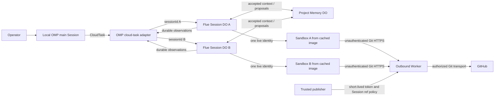

# 0002 — Agent Runtime value tracer

## Contract

Build the smallest Agent Runtime that can be evaluated against an equivalent fleet composed only from native OMP and Flue harness capabilities. The runtime treatment adds reusable Agent Profiles, one durable Flue conversation and one Cloudflare Sandbox started from a cached image with a verified dependency cache per Session, separately governed Project Memory, and brokered GitHub candidate publication.

**Success:** the treatment and harness-native baseline complete the same representative project tasks under matched models, tools, inputs, budgets, and cloud compute. Evidence shows whether the runtime materially improves recovery, safe concurrency, configuration reuse, inspectability, or work quality without unacceptable latency or cost.

**Not success:** a prompt-only cloud-agent demo; a local subagent process; shared writable Session state; exposed reusable credentials; ungoverned publication; an evaluation with mismatched models, inputs, budgets, or compute; treating agent reports as evidence; or continuing to build a general software system when harness-native composition performs equivalently.

## Goal, constraints, and values

### Goal

Determine empirically whether Agent Runtime is a valuable product seam or unnecessary machinery. Move delegated compute and durable state off the workstation only to support that comparison, not as proof of product value by itself.

### Constraints

- OMP remains the local operator interface and sole coordinator.
- Flue supplies the cloud agent harness and Durable Object Session lifecycle.
- Every delegated Session receives a distinct Cloudflare Sandbox.
- Each Flue conversation receives a distinct Durable Object instance selected by `sessionId`. Sessions of one Profile reuse that Profile's generated Flue agent class; the MVP defines exactly three Profile classes.
- One separately addressed Project Memory Durable Object owns accepted shared Project facts; Session conversation state remains private.
- Immutable Sandbox images and dependency caches are content-addressed optimizations. Trusted setup code stores cache payloads and their digests in a dedicated R2 `DependencyCache`; model-controlled Sessions have no cache-write capability. A cache mismatch or failure falls back to correct uncached setup.
- GitHub is the first authoritative repository provider.
- Every task names an exact base commit available from GitHub.
- The GitHub App, not the model or Sandbox, owns repository credentials.
- The evaluation must compare the runtime treatment with a harness-native baseline using matched tasks, models, tools, base commits, verification commands, budgets, and cloud execution substrate.
- The product decision must be made from committed outputs and trusted observations, not agent self-reports.
- No broader kernel, UI, scheduler, provider abstraction, or ontology implementation may begin before the evaluation satisfies the continuation criteria.
- Workers may publish candidate branches; they may not merge or modify protected branches.
- The first journey must use real remote execution, Git, commit, push, recovery, and cancellation.
- Every cloud-task call is authenticated before routing, preferably through a private service binding; `sessionId` addresses a Session and never authorizes access.
- The implementation pins exact compatible Flue, `@cloudflare/sandbox`, and Sandbox image versions in the lockfile and deployment manifest. Version changes alter Profile and cache digests.
- Operator authority is required before Cloudflare deployment and GitHub App installation.

### Values

1. **Per-Session isolation by construction:** no shared writable workspace or branch.
2. **Immutable input:** execution starts from an exact commit SHA, never a moving branch name.
3. **Capabilities, not credentials:** the worker requests checkout and publish effects without receiving a reusable secret.
4. **Candidate before authority:** a worker can create a reviewable result but cannot make it canonical.
5. **One coordinator:** OMP owns delegation; Flue executes bounded Sessions.
6. **Small interface, deep implementation:** checkout, run, observe, cancel, and publish hide provider and lifecycle machinery.
7. **Replaceable infrastructure:** GitHub, Sandbox, and Flue identities do not become domain identities.
8. **Shared memory without shared execution:** Sessions read accepted Project facts through an explicit interface; they never share conversation queues or writable workspaces.
9. **Cache is not truth:** immutable inputs and verification determine correctness; caches only reduce setup latency.
10. **Profiles before persistent agents:** reusable configuration survives; every execution remains a bounded Session instance.
11. **A runtime is a hypothesis:** native harness composition is the baseline, and equivalent outcomes falsify the need for a larger product.

## Invariants

All enforcers are planned until implementation is accepted.

| ID | Invariant | Required enforcer |
| --- | --- | --- |
| S1 | Each Session has at most one live Sandbox identity; replacement identities form a recorded, non-overlapping sequence. | Session lifecycle serialization, predecessor termination record, and replacement acceptance |
| S2 | A Session checks out exactly its requested base or acknowledged checkpoint commit. | Checkout host tool verifies `HEAD` before model execution |
| S3 | No two Sessions share a writable filesystem, checkpoint ref, or candidate branch. | Sandbox identity and deterministic Session ref derivation |
| S4 | Model-controlled code cannot read the GitHub App private key or installation token. | Worker secret binding, Outbound Worker credential attachment outside the container, and in-flight negative credential test |
| S5 | A Session can publish only a commit descended from its frozen base. | Publish validator checks Git ancestry |
| S6 | A Session can publish only paths allowed by its task grant. | Publish validator computes base-to-candidate changed paths |
| S7 | A Session can update only its own checkpoint and candidate refs without force. | Outbound Worker ref policy, trusted ref derivation, expected remote SHA, and non-force update |
| S8 | No worker can push or merge to the default or protected branch. | Required GitHub default-branch rule with no App bypass plus publisher and Outbound Worker ref denial |
| S9 | Session observations and final result survive local OMP termination. | Flue Durable Object persistence and recovery acceptance |
| S10 | Cancellation stops further tool execution and releases the Session lease within a bound. | Abort signal, Sandbox termination, and cancellation acceptance |
| S11 | Returned commit, changed paths, checks, and artifact digests describe the published candidate exactly. | Result construction from trusted Git and process observations |
| S12 | A failed or expired grant cannot publish. | Expiring Session capability plus denial test |
| S13 | Every Session conversation maps to a distinct Flue Durable Object instance while reusing one generated class per Profile. | Authenticated routing by caller-minted `sessionId` plus concurrent-session acceptance |
| S14 | Accepted shared Project facts have one Project Memory authority; Session messages and proposed facts are not shared truth. | Separate Session-facing read/propose binding, coordinator-only accept binding, append-only memory revisions, and denial tests |
| S15 | A cache entry is reusable only when runtime, platform, image, repository, lockfile, and payload digests match; cache failure cannot change task semantics. | Trusted pre-model setup writer, R2 payload digest verification, no Session cache-write interface, and uncached fallback |
| S16 | Every Session records one immutable Profile identity, revision, and content digest; changing configuration creates a new Profile revision. | Canonical Profile schema and Session creation decoder |
| S17 | Profile instances do not share mutable cognition, conversation state, workspace state, or credentials. | Per-Session DO, Sandbox, grant, and branch identities |
| S18 | Baseline and treatment trials differ only in the Agent Runtime capabilities under evaluation. | Generated paired-trial manifests and conformance check |
| S19 | A continuation claim is derivable from recorded trial evidence and frozen thresholds. | Evaluation report generator over decoded trial records |
| S20 | Knowledge of a `sessionId` grants no Session access. | Private service binding or authenticated Worker middleware plus unauthenticated denial tests |
| S21 | A cache entry can never carry a mutation produced by model-controlled code. | Cache eligibility ends before model execution; only trusted setup writes and verifies R2 payloads |

## User journey

1. The operator selects a registered Project repository and an exact GitHub base commit in OMP.
2. The operator asks the main OMP Session to delegate two independent tasks.
3. OMP creates two cloud task specifications with distinct Session identities, writable scopes, deadlines, and the same accepted Project Memory revision.
4. The cloud adapter addresses two distinct Flue conversation Durable Object instances.
5. Each Session reads the same accepted Project Memory snapshot without receiving sibling Session messages.
6. Each Flue Session allocates its own Cloudflare Sandbox from the matching immutable image and cache keys.
7. Each Sandbox checks out the exact base commit into `/workspace`; a cache miss or rejection performs correct uncached setup.
8. Each worker edits files, runs repository commands, and creates one or more local Git commits.
9. OMP observes durable progress from both Sessions and may send follow-up messages.
10. A worker may propose a durable Project fact with provenance. Only the Project Memory authority's accept transition makes it visible as accepted shared context.
11. Each worker requests publication of one candidate commit.
12. The trusted publisher verifies ancestry, changed-path scope, branch ownership, remote expectation, and grant validity.
13. The publisher pushes the exact candidate commit to the Session-owned GitHub branch without force.
14. OMP receives a structured result containing the base commit, candidate commit, branch URL, changed paths, commands, exits, and unresolved blockers.
15. The operator may review or merge outside this tracer. Merge is not delegated to the worker.
16. After restarting OMP, the operator can recover both Session histories, the accepted Project Memory revision, and results by identity.
17. The same task suite runs through the harness-native baseline with matched models, tools, Sandboxes, GitHub provider, inputs, and budgets.
18. An independent evaluator scores committed outputs and trusted observations without using the producing agent's conclusion.
19. The resulting report selects one outcome: expand Agent Runtime, collapse it to harness configuration/adapters, or reject the approach.

## Topology



**Reading the diagram:** OMP coordinates. One generated Flue class per Profile produces independently addressed Session DO instances. Each Session has private history and at most one live Sandbox. Git runs inside the Sandbox without credentials; an Outbound Worker attaches authorization and enforces Session-owned refs. Project Memory shares only accepted revisions.

## Minimal semantic inventory

| Object | Stable identity | Lifecycle | Authority |
| --- | --- | --- | --- |
| Project repository registration | `projectId` | Durable | Operator-managed configuration |
| Cloud task | `taskId` | Durable until retained result expires | OMP coordinator |
| Session | `sessionId` | Bounded and recoverable | Flue Durable Object |
| Agent Profile | `profileId`, monotonic `profileRevision`, content digest | Reusable and immutable by revision | Profile registry |
| Project Memory | `projectId`, monotonic `memoryRevision` | Project-durable | Project Memory Durable Object |
| Sandbox | provider identities associated with `sessionId`, at most one live | Session-scoped sequence | Cloudflare Sandbox runtime |
| Repository grant | `grantId`, Session, repository, base, scope, expiry | Bounded | Trusted publisher |
| Checkpoint and candidate refs | distinct trusted derivations from Project and Session identities | Durable Git refs | Session publisher only |
| Candidate result | `sessionId`, base, candidate, evidence | Durable | Derived from trusted observations |

Provider resource identifiers are projections of domain identities. They never replace `projectId`, `taskId`, `sessionId`, or `grantId`.

## Per-Session resource contract

Every Session receives all of the following; none are shared mutably with sibling Sessions:

| Resource | Session rule |
| --- | --- |
| Flue identity | One durable agent identity per `sessionId` |
| Sandbox | One live Sandbox provider identity; terminated predecessors and replacements are recorded in order |
| Workspace | One writable `/workspace` rooted at the exact base or acknowledged checkpoint commit |
| Refs | `agent/<project-slug>/<session-id>/wip` for checkpoints and `agent/<project-slug>/<session-id>` for the terminal candidate, or collision-resistant equivalents derived by trusted code |
| Repository grant | One repository, one base commit, one writable path scope, two derived Session refs, one expiry |
| Execution budget | Deadline, command-output bound, and model/tool limits |
| Observation cursor | Monotonic per Session |
| Final result | At most one accepted terminal result; later duplicate completion is idempotent |

Immutable images and verified content-addressed package caches may be reused. Trusted setup runs before model execution, records a byte digest, and writes the payload to the R2 `DependencyCache`; a Session cannot write cache entries and no post-model artifact is eligible. Restore verifies runtime, platform, image, repository, lockfile, and payload digests into a Session-local writable directory. Mismatch or corruption falls back to uncached setup.

Naming: **Session** always means this specification's domain Session—one Flue conversation with at most one live Sandbox. It never means a Cloudflare Sandbox SDK shell session, which shares filesystem and process space and is not an isolation boundary.

An **Agent Profile** is an immutable, runtime-decoded configuration class for cognitive execution. A **Session** is one bounded instance of one Profile revision. Profiles are reusable; Sessions are disposable.

The canonical Profile contains:

```text
profileId
profileRevision
profileDigest
role instructions
model policy
tool and effect capabilities
skill references and digests
hook references and digests
Sandbox image and cache policy
Project Memory read/propose/accept capability
repository checkout/publish capability
execution and evidence budgets
```

The MVP defines only the Profiles required by the comparative journey:

| Profile | Purpose | Distinct capability |
| --- | --- | --- |
| Project Orchestrator | Decompose Project work, instantiate worker Sessions, observe results, and exercise the coordinator-only memory-accept interface | May accept Project Memory proposals; may not execute repository commands or publish candidates |
| Project Worker | Perform bounded repository work in one Sandbox and return a candidate | May read accepted Project Memory, propose facts, execute tools, and request publication; may not accept memory or merge |
| Independent Reviewer | Judge candidate output and trusted evidence without sharing the producing Session's private history | Read-only repository and evidence access; no publication or memory-accept authority |

One exported Flue agent function with a pinned `agentName` represents each Profile class. The conversation identifier selects a Session DO instance of that class. Changing any load-bearing instruction, model policy, skill, hook, capability, image policy, or budget creates a new Profile digest and revision; renaming or migrating the generated class follows an explicit Flue storage migration. Session records retain the exact Profile identity, generated class, binding, migration tag, and configuration digest.

Harness-native baseline configuration is generated from the same trial manifest wherever the harness supports the concept. Facts that cannot be matched are recorded as the treatment variable rather than silently approximated.

## Interfaces

### OMP cloud-task interface

```text
spawn(sessionId, task) -> sessionAdmission
send(sessionId, messageId, message) -> acceptedCursor
observe(sessionId, afterCursor) -> observations
cancel(sessionId, reason) -> cancellationObservation
result(sessionId) -> pending | failed | cancelled | completed(result)
```

`task` contains:

- caller-minted `taskId` and `sessionId`;
- `projectId`;
- `profileId`, exact `profileRevision`, and `profileDigest`;
- exact `baseCommit`;
- objective;
- writable path patterns;
- required commands or checks, if any;
- deadline and output limits.

OMP mints `sessionId` before the first call. Repeating `spawn` with that identity returns the existing admission and creates no second DO, Sandbox, grant, or ref. `messageId` similarly deduplicates `send`; `acceptedCursor` is the monotonic observation cursor of durable admission.

The caller does not provide provider credentials, Sandbox identifiers, ref names, or GitHub installation tokens. Model and tool policy come from the immutable Profile rather than ad hoc task fields.

### Project Memory interfaces

Session-facing binding:

```text
readContext(atRevision, query) -> acceptedFacts
proposeMemory(expectedRevision, claim, provenance) -> proposalId
```

Coordinator authority binding:

```text
acceptMemory(proposalId, expectedRevision) -> newMemoryRevision
```

The Session-facing binding does not expose `acceptMemory`. Trusted host code binds `projectId` and `sessionId` from the Session grant; callers cannot name another Project or attribute a proposal to another Session. `readContext` returns only accepted, provenance-bearing facts from the exact requested revision. Project Memory retains an append-only revision log for every revision referenced by a live Session or retained result and fails visibly when a revision is unavailable; it never substitutes the latest. The separately configured coordinator binding is the sole route to `acceptMemory`; caller authority comes from the binding and authenticated transport, never request fields. Acceptance uses revision comparison to serialize conflicting updates. Session transcripts remain private.

### Trusted repository interface

```text
checkout(sessionGrant, baseOrCheckpointCommit) -> verifiedWorkspace
checkpoint(sessionGrant, commit, expectedRemoteCommit) -> acknowledgedCheckpoint
publishCandidate(sessionGrant, candidateCommit) -> publishedCandidate
```

`checkout` hides GitHub App token minting, Outbound Worker policy installation, cloning, and exact commit verification. A fresh Session starts from the frozen base; replacement compute starts from the latest acknowledged `.../wip` checkpoint.

`checkpoint` compare-and-set advances only the Session's WIP ref. `publishCandidate` writes the distinct candidate ref at most once, only at terminal completion. Both validate ancestry and changed-path scope and reject force or arbitrary refs. The candidate ref is absent before terminal publication, so a checkpoint cannot be mistaken for reviewable completion.

Git executes inside the Sandbox, which holds no credential. The trusted publisher mints the installation token, derives allowed refs, validates expected state, and configures an Outbound Worker keyed to the Sandbox identity. That proxy attaches the token to GitHub HTTPS outside the container and rejects every write outside the Session's WIP and candidate refs.

### Result contract

A completed result contains:

```text
sessionId
projectId
profileId
profileRevision
profileDigest
repository identity
base commit SHA
candidate commit SHA
candidate branch and URL
changed paths
commit metadata
commands attempted
observed exit status and bounded output references
artifact names and SHA-256 digests
started, completed, and published timestamps
unresolved blockers
```

A result is not Evidence of a command that the host did not observe. Agent prose is reported separately from trusted execution observations.

## GitHub authority contract

The first implementation uses a GitHub App installed only on operator-approved repositories.

Required installation permissions:

| Permission | Level | Reason |
| --- | --- | --- |
| Repository contents | Read and write | Clone and publish candidate branches |
| Pull requests | Optional write | Create a draft PR only if explicitly added later |
| Metadata | Read | GitHub-required repository identity |

Explicitly absent App permissions:

- administration;
- environments and deployments;
- secrets and variables;
- workflows mutation;
- organization administration.

Required repository configuration is a precondition: each registered repository is organization-owned; its default branch requires a pull request before merging or is locked; and the App is on no ruleset or branch-protection bypass list. `contents:write` alone can update any branch, so default-branch denial depends on this GitHub configuration as well as the publisher and Outbound Worker policies.

The App private key is a Worker secret. No GitHub credential enters a Sandbox environment, file, Git config, remote URL, credential helper, process argument, command input, or durable message. An Outbound Worker for Sandboxes attaches a short-lived installation token to intercepted `github.com` HTTPS traffic outside the container, keyed to the Sandbox identity, and enforces allowed Session refs and non-force updates.

## State and recovery

Each Flue conversation Durable Object is the authoritative home for one Session's lifecycle, private message history, observation cursor, cancellation, and terminal result. One generated Flue class per Profile backs independently addressed instances.

Project Memory is the single authority for accepted Project facts, provenance, and append-only `memoryRevision` history. It retains every revision pinned by a live Session or unexpired result and owns neither Session execution nor repository state.

The local OMP adapter may cache observations and Project context but must recover them by identity and revision. Restarting OMP must not create a replacement Session, duplicate publication, or promote a memory proposal.

Sandbox disk and processes are ephemeral. The latest acknowledged commit on the Session's WIP ref is the durable workspace checkpoint; the terminal candidate uses a distinct ref. Replacement compute rehydrates the exact WIP commit. R2 dependency caches are discardable verified derivations, never Session state.

Cloudflare Agent Memory remains deferred until account access and product maturity are verified. The first tracer uses the minimal Project Memory Durable Object interface above; vector retrieval and automatic memory extraction are not required.

## Execution and liveness

- Session creation is idempotent by `sessionId`.
- `spawn` returns after durable Session creation, not after task completion.
- Checkout must complete before model execution begins.
- Observation cursors are monotonic and replayable.
- `send` targets exactly one Session and is rejected after terminal completion.
- Terminal transitions are serialized in the Session DO; the first committed terminal state wins and is never overwritten. Cancellation prevents publication not already admitted. Any checkpoint or candidate that completes after cancellation remains an observed side effect recorded with its commit, ref, and URL in the cancelled result.
- Checkpoint and candidate publication are idempotent for the same commit and remote expectation.
- Conflicting publication fails visibly; it never force-pushes or silently rebases.
- Session deadlines are finite and recorded before execution.
- Before replacement accepts work, the predecessor Sandbox is terminated and recorded. The new identity rehydrates from the latest acknowledged WIP checkpoint; uncertain work is recorded as interrupted and never blindly replayed.

Exact timeout and retention values are implementation parameters, not semantic constants. Acceptance must use bounded values and prove expiry behavior.

## Failure behavior

| Failure | Required observation | Forbidden outcome |
| --- | --- | --- |
| Unknown Project or repository | Rejected before Session creation | Arbitrary repository clone |
| Base commit unavailable | Checkout failure naming the immutable input | Fallback to branch head |
| Sandbox allocation failure | Session failure with provider cause | Local execution fallback |
| GitHub grant mint failure | Checkout or publish failure | Long-lived fallback credential |
| Changed path outside scope | Publish rejection with offending paths | Partial or filtered push |
| Candidate not descended from base | Publish rejection | Rebase performed by publisher |
| Candidate branch already advanced unexpectedly | Conflict result with observed remote SHA | Force-push |
| Credential detected in workspace or output | Security failure and no publication | Redacted success claim |
| Local OMP disconnect | Cloud Session continues within its bounds | Session loss or duplicate creation |
| Cancellation | Terminal cancellation observation plus any already-admitted Git ref side effect | New model tools or newly admitted publication |
| Flue/Sandbox restart cannot recover | Explicit Session failure | Invented successful result |
| Requested memory revision unavailable | Failure naming the requested revision | Substitution of the latest revision |
| Session deadline exceeded | Terminal deadline failure and released Sandbox | Publication after expiry or silent extension |
| Command output bound exceeded | Explicit truncation observation plus bounded output reference | Silent truncation reported as complete output |

## Security boundary

Trusted:

- OMP operator authentication and Project selection;
- cloud-task adapter admission;
- Flue host lifecycle code;
- Project Memory authority;
- repository grant issuer, Outbound Worker, and publisher;
- trusted pre-model cache setup and R2 dependency-cache store;
- GitHub and Cloudflare provider enforcement.

Untrusted:

- task prose;
- model output;
- repository contents;
- commands executed in the Sandbox;
- files produced by the worker;
- commit messages;
- claimed test results not observed by the host.

Repository content can instruct the model but cannot grant repository, deployment, credential, or merge authority.

## Comparative product evaluation

### Hypothesis

Reusable Profiles plus explicit Project Memory, Session recovery, and governed repository effects improve multi-Session project development enough to justify an Agent Runtime beyond native harness composition.

### Trial arms

| Arm | Included |
| --- | --- |
| Harness-native baseline | OMP/Flue hooks, skills, subagents, native conversation persistence, the same per-Session Sandboxes, cached images, verified dependency cache, and trusted GitHub adapter |
| Agent Runtime treatment | The same substrate plus immutable Profile instantiation, revisioned Project Memory proposal/accept semantics, explicit Session recovery contract, scoped grants, and structured trusted evidence |

Neither arm may receive a better model, larger token/tool budget, warmer cache, different base commit, stronger instructions, extra human intervention, or a different verification command.

### Task suite

Use at least three representative tasks:

1. **Bounded change:** one worker changes and verifies a small repository behavior.
2. **Concurrent change:** two workers operate concurrently from one base with independent scopes and candidates.
3. **Handoff and recovery:** one Session produces durable context and is interrupted; a replacement or resumed Session must continue without private chain-of-thought.

Run each task-arm pairing at least three times in fresh Session identities. Pair cache state and randomized arm order. Preserve every failed run.

### Recorded measures

| Measure | Source |
| --- | --- |
| Observable task correctness | Named repository verification plus independent review of the committed candidate |
| Safety violations | Trusted grant, branch, workspace, credential, and memory-transition observations |
| Recovery success | Injected OMP disconnect, Flue interruption, and post-checkpoint Sandbox replacement observations plus resulting Session/candidate identities |
| Operator interventions | Authenticated operator commands after initial task admission |
| Configuration duplication | Profile/trial manifest digests and generated harness configuration |
| Reconstructability | Whether an independent reviewer can derive base, candidate, checks, Profile, memory revision, and authority transitions |
| Model/tool consumption | Provider usage and trusted tool observations |
| Setup and completion latency | Durable admission, first-command, publication, and terminal timestamps |
| Direct infrastructure cost | Cloudflare, inference, and GitHub-related measured usage attributable to the trial |
| Friction | Structured cold-agent log of ambiguity, missing capability, workaround, or manual repair |

### Product decision

All arms must satisfy repository correctness and have zero credential, protected-branch, cross-workspace, or unauthorized-memory violations.

Choose **expand Agent Runtime** only when the treatment:

- preserves or improves task correctness across the paired trials;
- succeeds in every injected recovery trial;
- makes every accepted memory and repository authority transition reconstructable;
- demonstrates configuration reuse through identical Profile digests rather than copied configuration; and
- materially improves at least two of recovery intervention count, concurrency isolation, reconstructability, cold-agent friction, or model/tool consumption without increasing median completion cost or latency by more than 20% unless the measured correctness gain justifies that overhead.

Choose **collapse to harness configuration/adapters** when native hooks, skills, subagents, and harness persistence meet the same correctness, recovery, isolation, reuse, and reconstructability bar without the runtime semantics. Preserve only the reusable Profile schema/templates or provider adapters that independently earn their cost.

Choose **reject or redesign** when neither arm completes the journey safely, or when Cloudflare/Flue/GitHub constraints prevent a fair comparison.

The report must expose raw trial records, aggregation logic, failed runs, and threshold results. Narrative preference cannot override the recorded outcome.

## Acceptance and proof

### End-to-end acceptance

Against an operator-authorized Cloudflare deployment and GitHub App installation:

1. Register one organization-owned GitHub fixture repository, apply the required default-branch rule, verify the App is on no bypass list, freeze its base commit, and accept one provenance-bearing Project Memory fact.
2. From OMP, spawn two Sessions against that same base and memory revision with non-overlapping writable scopes.
3. Observe distinct Flue conversation DO identities, live Sandbox identities, workspace roots, grants, WIP refs, and candidate refs, backed by one pinned generated class per Profile.
4. Verify both Sessions read the accepted Project fact while neither can read the other's private messages.
5. Instantiate both workers from the same Profile revision and record every task-specific field.
6. Demonstrate one verified R2 dependency-cache restore and one rejected/missing-cache fallback; require `HEAD` equality and byte-identical installed-tree digests.
7. Have one Session propose a new Project fact; verify it remains invisible as accepted context until the authority accepts it at the expected revision.
8. Publish both candidates through the trusted publisher.
9. Verify both GitHub branches point to the exact reported commits and descend from the frozen base.
10. Verify neither candidate contains out-of-scope changes or credentials.
11. Terminate and restart local OMP, then recover both private histories, the accepted Project Memory revision, and terminal results without duplicate Sessions or pushes.
12. After acknowledging a WIP checkpoint, destroy the Sandbox, record predecessor termination, rehydrate one replacement from that exact commit, and verify uncertain work is neither claimed nor replayed.
13. Cancel one Session during command execution and another during an in-flight checkpoint or terminal publication; verify one terminal state each and record every resulting Git ref.
14. Expire a short-deadline Session during execution; verify terminal deadline failure, released Sandbox, and no terminal candidate.
15. Record Profile/class/binding/migration identities, pinned package and image versions, provider identities, Git SHAs, memory revisions, cache keys, commands, exits, interruptions, and artifact digests.

### Required negative controls

- reject an unavailable base commit rather than using the default branch head;
- reject an out-of-scope changed path;
- reject a candidate not descended from the granted base;
- bypass the publisher in trusted test code and attempt a direct installation-token push to the protected default branch; record GitHub's rejection;
- reject an expired or mismatched repository grant;
- reject a stale WIP expectation without force-push;
- prove model-started code cannot obtain the installation token during an in-flight Git operation, including environment, `/proc`, Git config, helpers, arguments, and PATH shadowing;
- reject valid-`sessionId` cloud-task calls without operator authentication for `send`, `observe`, `cancel`, and `result`;
- prove a trial manifest cannot assign different models, budgets, base commits, cache state, or verification commands to paired arms;
- prove a known-bad treatment record produces a non-expansion decision;
- prove Profile changes produce a new digest and cannot mutate existing Sessions;
- prove two concurrent Sessions cannot observe or mutate each other's workspace or refs;
- prove replacement starts from the latest acknowledged WIP checkpoint and the candidate ref is absent before terminal publication;
- prove a Session capability cannot call `acceptMemory`, including on its own proposal;
- reject stale `acceptMemory`, cross-Project reads, and forged sibling-Session proposal attribution;
- accept a new fact while Sessions remain pinned to and continue reading an earlier revision;
- reject unknown or pruned memory revisions rather than substituting latest;
- prove Session-private messages never enter sibling context or Project Memory implicitly;
- reject cache key or payload digest mismatches and fall back safely;
- prove model-controlled code cannot write or influence an R2 cache entry another Session restores;
- prove no local treatment-arm subagent process was started; baseline local processes are measured, not forbidden.

### Falsifiers

This design must be revised if any of the following is true:

- Flue cannot provide one durable, independently addressable Session per delegation.
- Cloudflare Sandbox cannot hold an isolated Linux workspace for a bounded command run, or rehydration from base and acknowledged WIP checkpoint is too slow or unreliable for the recovery trial.
- Credential isolation requires exposing a GitHub credential to model-controlled code.
- GitHub cannot enforce default-branch denial under the required repository configuration.
- Recovery duplicates execution or publication, cannot distinguish WIP checkpoints from terminal candidates, or cannot distinguish acknowledged from uncertain work.
- OMP requires a local worker process to operate the cloud task interface.
- Two Sessions require a shared writable filesystem, branch, or credential.

## Explicit non-goals

- Running the main OMP Session in Cloudflare.
- Running the exact OMP binary inside each worker.
- Rebuilding a universal agent harness.
- A custom general Project authority, semantic kernel, Gate, Grant, Proposal, or Merge engine beyond the narrow Project Memory authority in this cloud path.
- Herdr, SSH attachment, custom container daemons, or per-Session Unix user management.
- D1 projection, Queues, Workflows, custom R2 manifests, or an outbox.
- Cloudflare Agent Memory, Vectorize, AI Search, or AutoRAG; the tracer uses a minimal revisioned Project Memory Durable Object.
- Expanding Agent Runtime beyond the evaluated Profile, Session, Project Memory, repository, and evidence seams before the comparative result.
- Treating hooks, skills, subagents, or other harness-native capabilities as competitors to hide; they are the explicit baseline.
- Preserving Agent Runtime code or concepts that do not independently earn their cost after a collapse outcome.
- `@cloudflare/computer`, whose JavaScript shell cannot run the native Git, package-manager, and repository commands required by this tracer.
- Browser Run unless a delegated task explicitly requires browser interaction.
- Automatic PR review, merge, deployment, or protected-branch updates.
- Provider-neutral repository support before the GitHub journey passes.
- Delegating uncommitted local-only files in the first journey.
- A web, desktop, or mobile frontend.

### Disposition of superseded 0001 artifacts

The partially built 0001 kernel, Cloudflare projection/queue/outbox, and Herdr session-host code are frozen historical artifacts, not implementation substrate for 0002. Implementation must remove them unless a file is independently required by this contract and is rewritten against a named 0002 interface. Passing legacy tests does not constitute 0002 evidence.

## Deferred decisions

| Decision | Reopen when |
| --- | --- |
| Cloudflare Agent Memory | Private-beta access exists and it can replace the Project Memory adapter without weakening revision, provenance, or proposal/accept semantics |
| Profile catalog beyond three tracer Profiles | A repeated project journey requires a materially different capability set |
| General Agent Runtime product | Comparative trials satisfy the frozen expansion criteria |
| `@cloudflare/computer` | It gains native binary and package-manager execution sufficient for Git and repository commands; then compare isolation, recovery, and latency |
| Cloudflare Artifacts as a Git remote | A Project lacks GitHub or must delegate an uncommitted content-addressed snapshot |
| Cloudflare Workflows | A single Flue Session cannot durably express the required bounded execution |
| Browser Run | A concrete delegated journey requires browser state |
| Draft PR creation | Candidate branch publication is accepted and the operator wants PR automation |
| Additional Git providers | A second provider is required, making the repository seam real rather than hypothetical |
| Main OMP active-context offload | Durable Session execution and shared Project Memory work; active model context cannot be removed while OMP remains local |

## Source evidence

- [Flue — Deploy to Cloudflare](https://flueframework.com/docs/ecosystem/deploy/cloudflare/) — Flue Durable Object agents, subagents, virtual sandboxes, and the supported `@cloudflare/sandbox` adapter for full Linux coding agents.
- [Cloudflare — Bringing more agent harnesses and frameworks to Cloudflare, starting with Flue](https://blog.cloudflare.com/agents-platform-flue-sdk/) — official Flue/Agents SDK integration and platform posture.
- [Cloudflare — Agents Week 2026 review](https://blog.cloudflare.com/agents-week-in-review/) — Sandbox GA, Browser Run, Workflows, Artifacts, Agent Memory, and current platform products.
- [Cloudflare — Your agent needs a computer](https://blog.cloudflare.com/cloudflare-computer/) — `@cloudflare/computer` early-preview scope and backend model.
- [Cloudflare — Agents that remember](https://blog.cloudflare.com/introducing-agent-memory/) — Agent Memory private-beta scope.
- [GitHub — Authenticating as a GitHub App installation](https://docs.github.com/en/apps/creating-github-apps/authenticating-with-a-github-app/authenticating-as-a-github-app-installation) — short-lived installation access tokens and repository/permission scoping.
- [GitHub — About protected branches](https://docs.github.com/en/repositories/configuring-branches-and-merges-in-your-repository/managing-protected-branches/about-protected-branches) — protected-branch restrictions and bypass controls.
- [Cloudflare — Container limits and instance types](https://developers.cloudflare.com/containers/platform-details/limits/) — per-container CPU, memory, and disk bounds plus account-level horizontal capacity; supports per-Session horizontal scaling rather than a shared mutable Project container.
- [Flue — Cloudflare target](https://flueframework.com/docs/guide/cloudflare-target/) — one generated class per agent function, one persistent stateful conversation per addressed identity, durable per-conversation queues, serialized response execution, and Cloudflare Sandbox integration.
- [Cloudflare — Dynamic, identity-aware, and secure Sandbox auth](https://blog.cloudflare.com/sandbox-auth/) — Outbound Workers attach credentials outside containers and support per-instance egress policy.
- [Cloudflare — Sandbox lifecycle](https://developers.cloudflare.com/sandbox/concepts/sandboxes/) — containers and their files are ephemeral across inactivity or failure; durable recovery must come from external checkpoints.
