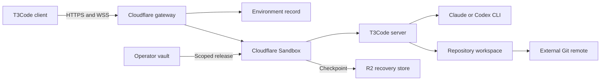
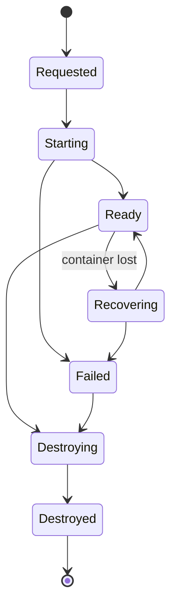

# 0003 — Cloudflare T3Code environments

## Contract

Build the smallest hosted remote coding environment on Cloudflare.

A user creates an environment from an exact repository commit. Cloudflare starts one Sandbox that runs the real T3Code server. An existing T3Code client pairs with that server. The user runs one Claude or Codex turn, commits a change, survives container loss, reconnects, and destroys the environment.

**Success:** The complete journey works without an active operator workstation. The user controls the remote agent through an existing T3Code client.

**Not success:** A custom agent harness, a replacement T3Code server, a CI runner, a local process, or an environment that loses uncommitted work without an explicit warning.

## Product decision

The product is a Cloudflare-hosted T3Code execution environment. It is not a general Agent Runtime.

T3Code remains the authority for:

- agent threads;
- provider processes;
- terminal processes;
- filesystem operations;
- Git operations;
- environment-local settings.

Cloudflare owns:

- environment provisioning;
- environment identity and lifecycle;
- authenticated routing;
- secret release;
- recovery checkpoints;
- resource limits and destruction.

GitHub, GitLab, or Bitbucket remains an external Git remote. The first tracer uses one provider only.

## Values

1. Use the real T3Code server and protocol.
2. Use one Sandbox for one execution environment.
3. Treat an environment identifier as an address, not as authority.
4. Keep provider and Git credentials out of the browser.
5. Start from an exact repository commit.
6. Preserve recovery state outside the Sandbox.
7. Make creation, recovery, and destruction idempotent.
8. Prove one complete journey before adding orchestration or shared memory.

## Architecture

The gateway resolves one authenticated environment route. The T3Code client communicates with the unmodified T3Code server protocol.

### Components

| Component | Owns | Does not own |
| --- | --- | --- |
| Provisioning API | Create, inspect, recover, and destroy commands | T3Code threads |
| Environment Durable Object | Lifecycle serialization and stable environment identity | Filesystem contents |
| Gateway Worker | Authentication and HTTP/WSS routing | Agent orchestration |
| Cloudflare Sandbox | T3Code server, agent CLIs, repository, and processes | Durable recovery truth |
| Operator vault | Provider and Git credentials | Environment state |
| R2 recovery store | Encrypted T3Code and workspace checkpoints | Live process state |
| T3Code server | Threads, terminals, providers, files, and Git | Cloudflare lifecycle |

## Environment model

An `Environment` has:

- an immutable environment identifier;
- one owner;
- one Sandbox identifier at a time;
- one pinned runtime image digest;
- one repository identity;
- one exact base commit;
- one lifecycle state;
- one current checkpoint generation;
- one credential lease expiry;
- creation, activity, and destruction timestamps.

A replacement Sandbox keeps the logical environment identifier. It receives a new Sandbox identifier and a new credential lease.

## Lifecycle

### Lifecycle rules

- `create` is idempotent for one caller command identifier.
- `Starting` pins the image, repository, base commit, and credential lease.
- `Ready` means that the T3Code health endpoint and WebSocket endpoint respond.
- `Recovering` creates a new Sandbox and restores the latest accepted checkpoint.
- `Destroying` revokes credentials before it deletes runtime and checkpoint data.
- `Destroyed` rejects all routing and recovery requests.
- Only the Environment Durable Object can change lifecycle state.

## Connection flow

1. The operator authenticates to the provisioning API.
2. The operator selects a repository and an exact commit.
3. The provisioning API creates the Environment record.
4. The Environment Durable Object starts one Sandbox.
5. The Sandbox restores state or initializes a clean workspace.
6. The Sandbox starts the T3Code server in headless mode.
7. The gateway checks the health and WebSocket endpoints.
8. The provisioning API returns a short-lived T3Code pairing URL.
9. The T3Code client exchanges the pairing token directly with the gateway.
10. The client uses the normal T3Code Effect RPC WebSocket protocol.

The hosted T3Code application never proxies traffic and never receives provider credentials.

## Credentials

The first tracer uses an operator-owned vault.

The control plane releases credentials only after it admits an environment. Each release binds to:

- one environment identifier;
- one provider;
- one repository scope;
- one expiry;
- one Sandbox generation.

The browser receives only a scoped T3Code pairing credential. The Sandbox does not receive the vault root credential.

A recovery operation revokes the old lease before it issues a new lease. A destroy operation revokes all active leases.

## Persistence and recovery

Cloudflare Sandbox files and processes are ephemeral. The design does not treat `keepAlive` as durability.

An accepted checkpoint contains:

- the T3Code state directory;
- uncommitted workspace changes;
- the current Git `HEAD`;
- hidden T3Code checkpoint refs;
- the runtime image digest;
- the T3Code server version;
- the checkpoint generation and digest.

The checkpoint writer uploads encrypted bytes to R2. It then atomically advances the accepted generation in the Environment record. Recovery reads only that accepted generation.

The tracer forces container loss after a committed change. It verifies thread and workspace recovery after reconnection.

## Repository behavior

The first tracer uses GitHub.

The environment:

- clones one repository;
- checks out one exact base commit;
- records the remote URL without embedded credentials;
- uses a scoped credential for fetch and push;
- never pushes directly to a protected branch;
- preserves commits as the strongest recovery artifact.

GitLab Workspaces and Bitbucket runners are outside this architecture. GitLab Workspaces is an alternative Kubernetes platform. Bitbucket runners are CI workers.

## Failure behavior

| Failure | Required result |
| --- | --- |
| Invalid pairing credential | Reject before Sandbox routing |
| Expired credential lease | Revoke access and require recovery or reauthorization |
| Sandbox start failure | Record `Failed`; do not return a pairing URL |
| T3Code readiness failure | Stop the Sandbox and record the diagnostic |
| Container loss | Enter `Recovering`; restore the accepted checkpoint |
| Checkpoint digest mismatch | Reject recovery; retain the previous accepted generation |
| Git credential failure | Keep local work and report the failed Git operation |
| Destroy during recovery | Destruction wins; no replacement Sandbox becomes ready |
| Request after destruction | Reject without starting a Sandbox |

## Invariants

| ID | Requirement | Planned enforcer |
| --- | --- | --- |
| E1 | One Environment has at most one live Sandbox generation. | Durable Object lifecycle serialization |
| E2 | Environment identity routes but never authorizes. | Gateway authentication before lookup |
| E3 | The browser cannot read provider or Git credentials. | Vault release only to the Sandbox boundary |
| E4 | A credential lease belongs to one Environment and Sandbox generation. | Lease schema and admission check |
| E5 | Recovery uses one digest-verified accepted checkpoint. | R2 digest check plus generation pointer |
| E6 | Destroyed environments cannot restart. | Terminal lifecycle state |
| E7 | Startup uses one exact repository commit. | Runtime decoder and Git `HEAD` check |
| E8 | T3Code remains the only thread and agent orchestration authority. | Unmodified T3Code RPC boundary |
| E9 | A failed checkpoint cannot replace the previous accepted checkpoint. | Upload before atomic generation advance |
| E10 | Destroy revokes credentials before runtime deletion. | Ordered destruction transition |

All enforcers remain planned until implementation and acceptance prove them.

## Tracer acceptance

The tracer is complete only when all steps use real services:

1. Create one environment from an exact commit.
2. Receive a valid hosted T3Code pairing URL.
3. Pair an existing T3Code web, desktop, or mobile client.
4. Start one real Claude or Codex thread.
5. Run a command in the remote terminal.
6. Modify a tracked repository file.
7. Create a Git commit.
8. Capture a digest-verified checkpoint.
9. Force the Sandbox container to terminate.
10. Reconnect through the same logical environment.
11. Recover the thread, commit, and workspace state.
12. Destroy the environment.
13. Verify that the old endpoint and credentials no longer work.

### Required evidence

- environment lifecycle events;
- Sandbox generation identifiers;
- T3Code readiness and RPC observations;
- exact base and final commit identifiers;
- checkpoint generation and digest;
- credential issuance and revocation receipts without secret values;
- denial after destruction;
- operator-visible tap-by-tap reproduction steps.

## Explicit non-goals

- A replacement T3Code server or client.
- A new agent protocol.
- A universal Work ontology.
- Shared Project Memory.
- Multi-agent scheduling.
- GitLab or Bitbucket hosting.
- GitLab Workspaces or Bitbucket runners.
- Platform-owned provider billing.
- Per-user provider OAuth.
- Collaboration between environment owners.
- Protected-branch merge automation.
- A general provider abstraction before the first tracer passes.

## Sources

- [T3Code remote architecture](https://github.com/pingdotgg/t3code/blob/main/docs/internals/remote.md)
- [T3Code server architecture](https://github.com/pingdotgg/t3code/blob/main/docs/internals/overview.md)
- [Cloudflare Sandbox lifecycle](https://developers.cloudflare.com/sandbox/concepts/sandboxes/)
- [GitLab Workspaces](https://docs.gitlab.com/user/workspace/)
- [Bitbucket runners](https://support.atlassian.com/bitbucket-cloud/docs/runners/)
