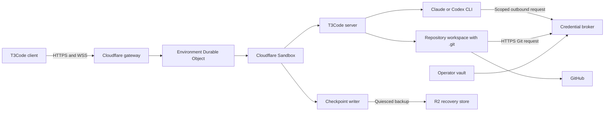
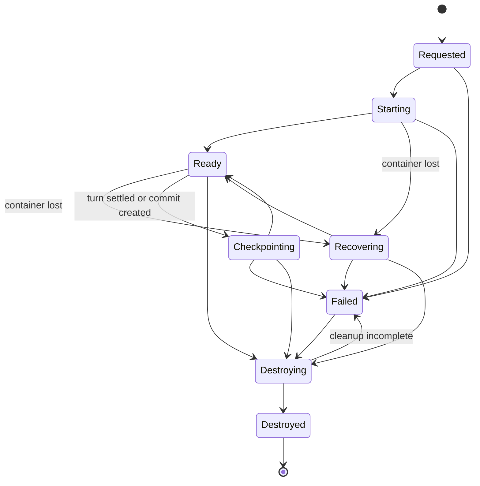

# 0003 — Cloudflare T3Code environments

## Contract

Build the smallest hosted remote coding environment on Cloudflare.

A user creates an environment from an exact repository commit. Cloudflare starts one Sandbox that runs the real T3Code server. An existing T3Code client pairs with that server. The user runs one Claude or Codex turn, commits a change, survives container loss, reconnects, and destroys the environment.

**Success:** The complete journey works without an active operator workstation. The user controls the remote agent through an existing T3Code client.

**Not success:** A custom agent harness, a replacement T3Code server, a CI runner, a local process, or an environment that loses uncommitted work without an explicit warning.

## Product decision

The product is a Cloudflare-hosted T3Code execution environment. It is not a general Agent Runtime.

T3Code remains the authority for:

- agent threads;
- provider processes;
- terminal processes;
- filesystem operations;
- Git operations;
- environment-local settings.

Cloudflare owns:

- environment provisioning;
- environment identity and lifecycle;
- lifecycle-gated HTTP/WSS routing;
- provider and Git credential brokering;
- quiesced recovery checkpoints;
- resource limits and destruction.

GitHub is the first Git remote. GitLab and Bitbucket remain possible later remotes.

## Values

1. Use the real T3Code server and protocol.
2. Use one Sandbox for one execution environment.
3. Treat an environment identifier as an address, not as authority.
4. Keep long-lived provider and Git credentials outside the browser and Sandbox.
5. Start from an exact repository commit.
6. Preserve recovery state outside the Sandbox.
7. Make creation, recovery, and destruction idempotent through durable command receipts.
8. Prove one complete journey before adding orchestration or shared memory.

## Resource policy

The tracer pins Cloudflare `standard-2`: 1 vCPU, 6 GiB memory, and 12 GB disk.

An Environment has an eight-hour maximum lifetime. It enters `Destroying` after 30 minutes with no connected client and no active T3Code turn. Automatic destruction first completes and accepts a quiesced checkpoint. A failed final checkpoint leaves the Environment in `Failed`, blocks routing, retains its tombstone, and retries cleanup; it does not keep an abandoned Sandbox running.

## Architecture

The gateway resolves a public, non-secret environment endpoint. T3Code authenticates its own client protocol. The gateway rejects terminal or retired environments before it constructs a Sandbox stub.

### Components

| Component | Owns | Does not own |
| --- | --- | --- |
| Provisioning API | Create, inspect, recover, and destroy commands | T3Code threads |
| Environment Durable Object | Lifecycle, command receipts, readiness, generations, and retired Sandbox tombstones | Filesystem contents |
| Gateway Worker | Lifecycle gate and HTTP/WSS routing | T3Code client authentication or agent orchestration |
| Credential broker | Provider and Git secrets, outbound host policy, generation leases, and revocation | Environment state |
| Cloudflare Sandbox | T3Code server, agent CLIs, repository, and processes | Durable recovery truth or long-lived credentials |
| Operator vault | Root provider credentials and GitHub App private key | Environment state |
| Checkpoint writer | Quiescence, backup creation, validation, and accepted-generation advance | Live T3Code authority |
| R2 recovery store | R2-encrypted SDK backups, retention, and reclamation | Live process state |
| T3Code server | Threads, terminals, providers, files, Git, client sessions, and pairing | Cloudflare lifecycle |

## Environment model

An `Environment` has:

- an immutable lowercase DNS-safe environment identifier;
- one owner;
- one current Sandbox identifier and a tombstone set of retired identifiers;
- one pinned tuple of runtime image digest, T3Code version, and Sandbox SDK line;
- one repository identity and exact base commit;
- one lifecycle state;
- one accepted checkpoint generation;
- one provider lease and one GitHub installation-token lease expiry;
- durable command receipts for create, recover, and destroy;
- creation, activity, and destruction timestamps;
- one fixed eight-hour expiry and a 30-minute inactivity deadline.

Command receipts retain the accepted input and result for the Environment lifetime. A replacement Sandbox keeps the logical environment identifier. It receives a new Sandbox identifier and new outbound leases.

## Lifecycle

### Lifecycle rules

- Create, recover, and destroy are idempotent for one caller command identifier.
- `Starting` pins the version tuple, repository, base commit, and credential leases.
- The Environment Durable Object records `Ready` after an HTTP health response and an authenticated `/ws` upgrade with its bootstrap session.
- A transport disconnect with a live container does not change lifecycle state. The client reconnects to the same Sandbox generation.
- `Recovering` revokes old outbound leases before it restores the accepted checkpoint into a new Sandbox.
- `Destroying` revokes leases, disables `keepAlive`, destroys the Sandbox, and requests best-effort deletion of retained checkpoint data.
- `Destroyed` rejects all routing and recovery requests.
- The Durable Object checks lifecycle and tombstones before any code constructs a Sandbox stub.
- Only the Environment Durable Object can change lifecycle state.
- Every transition to `Failed` blocks routing, disables `keepAlive`, preserves tombstones and diagnostics, and schedules idempotent destruction retries.

## Connection flow

1. The operator authenticates to the provisioning API.
2. The operator selects a GitHub repository and an exact commit.
3. The provisioning API creates the Environment record.
4. The Environment Durable Object starts one Sandbox.
5. The Sandbox restores state or initializes `/environment`.
6. The Sandbox starts `t3 serve --host 0.0.0.0` on port `3773`.
7. The Durable Object verifies HTTP health and an authenticated `/ws` upgrade.
8. The control plane consumes the owner bootstrap token inside its boundary.
9. The control plane mints an ordinary T3Code pairing token with the required client scopes and an explicit TTL.
10. The provisioning API returns the public environment endpoint and pairing token in the standard T3Code URL form.
11. The T3Code client exchanges the token through the gateway.
12. The client uses the normal T3Code Effect RPC WebSocket protocol.

The gateway forwards WebSocket upgrades with `sandbox.wsConnect(request, 3773)`. It forwards HTTP through a Worker-fronted exposed port after the lifecycle check. It never returns the preview URL. Quick tunnels and bare `proxyToSandbox()` routes are forbidden. Before Sandbox routing, Cloudflare rate-limit bindings cap new connection attempts at 30 per minute for each source IP and Environment, cap total HTTP requests at 120 per minute for each source IP and Environment, and cap concurrent connections for each Environment at 10.

The endpoint is public and non-secret. The hosted T3Code application can receive its hostname. The pairing token stays in the URL fragment and does not reach the hosted application origin.

## Credentials

The first tracer uses an operator-owned vault and a GitHub App.

The Sandbox receives only short-lived generation tokens for the credential broker. It never receives a root provider credential, GitHub App private key, or installation token.

The credential broker:

- disables unrestricted Sandbox internet access;
- permits an explicit host allowlist;
- holds the root Claude or Codex credential;
- attaches the provider credential to approved HTTPS requests;
- mints and attaches one GitHub App installation token for the selected repository;
- binds every broker token to one Environment, Sandbox generation, host set, and expiry;
- supports Git over HTTPS only.

Recovery revokes the old broker token and GitHub installation token before it issues new tokens. Destroy revokes every revocable token before it destroys the runtime.

T3Code client sessions belong to the logical Environment, not to a Sandbox generation. A checkpoint preserves those sessions for reconnect. Destruction makes them unusable because the terminal Environment cannot route or recover.

The owner bootstrap token never leaves the control-plane boundary. The delivered pairing token has only `orchestration:read`, `orchestration:operate`, `terminal:operate`, `review:write`, and `relay:read`. It never has `access:write` or `relay:write`.

## Persistence and recovery

Cloudflare Sandbox files and processes are ephemeral. A `Ready` environment uses `keepAlive: true` to prevent the default idle stop. This setting controls availability, not durability.

The checkpoint writer runs after each settled T3Code turn, after each Git commit, and before a deliberate stop. The client shows a data-loss warning while live workspace state is newer than the accepted checkpoint.

Checkpoint capture uses this ordered protocol:

1. Enter `Checkpointing` and stop new routed requests.
2. Drain the current T3Code turn and Git operation.
3. Stop the T3Code server cleanly.
4. Run SQLite integrity checks against the stopped T3Code state.
5. Verify that the backup process can read all of `/environment`; normalize owner-read permissions for non-secret workspace files.
6. Record a candidate header with `state_capture: quiesced`, Git `HEAD`, the pinned version tuple, and generation.
7. Call `createBackup({ dir: "/environment", name, useGitignore: false, ttl: 2_592_000 })` once and retain its `DirectoryBackup` handle.
8. Restart T3Code and return to `Ready`, unless this is the final pre-destroy checkpoint.
9. If validation is required, restore the handle in an isolated validation Sandbox and verify T3Code startup, SQLite integrity, and Git `HEAD`.
10. Atomically promote the candidate only if it remains the newest valid candidate and the generation already has a validated accepted handle or this candidate passed validation.

The first accepted handle promoted in each runtime generation must pass full validation. While a generation has no validated accepted handle, a newer candidate can supersede the candidate under validation, but it must itself pass validation before promotion. Full validation is also required for the final pre-destroy checkpoint and the acceptance tracer. The validation Sandbox has no environment endpoint, credentials, repository publication authority, or T3Code client route. It is recovery machinery, not a live Environment generation under E1.

An unreadable path or `createBackup` failure restarts T3Code, returns to `Ready`, retains the previous accepted handle, keeps the data-loss warning visible, and retries at most three times over 15 minutes. Exhaustion enters `Failed`. A final pre-destroy capture failure enters `Failed` immediately and proceeds with the cleanup policy.

Recovery rejects a backup without `state_capture: quiesced`. It also rejects a Git `HEAD`, SQLite integrity, or version-tuple mismatch. A failed capture or stale validation result never replaces the accepted handle.

Production recovery retains the `DirectoryBackup` handle in the Environment record and re-runs `restoreBackup(handle)` after every container start or restart, before it starts T3Code. It never assumes that the production FUSE overlay survives a restart.

The explicit backup TTL and R2 lifecycle are both 30 days. R2 provides managed encryption at rest. The Durable Object treats an unpromoted handle as staging state and tracks the latest two accepted handles. A cleanup alarm lists the directly bound `BACKUP_BUCKET`, matches objects to tracked backup identifiers, and requests best-effort deletion of one-day-old unpromoted backups, superseded accepted backups, and every tracked backup at destruction. The 30-day R2 lifecycle is the hard storage bound if key resolution or cleanup fails.

The first tracer uses a required validation restore before forced loss.

## Repository behavior

The first tracer uses a GitHub App installation access token that is scoped to one repository and expires after one hour.

The environment:

- clones one repository over HTTPS;
- checks out one exact base commit;
- records a remote URL without embedded credentials;
- accesses GitHub through the credential broker;
- never pushes directly to a protected branch;
- checkpoints the complete `.git` directory, including objects, refs, index, and `HEAD`.

GitLab Workspaces and Bitbucket runners are outside this architecture. GitLab Workspaces is an alternative Kubernetes platform. Bitbucket runners are CI workers.

## Failure behavior

| Failure | Required result |
| --- | --- |
| Invalid T3Code pairing credential | T3Code rejects it through the routed Sandbox response |
| Expired broker or GitHub lease | Reject the outbound operation and require lease replacement |
| Sandbox start failure | Record `Failed`; do not return a pairing URL |
| T3Code readiness failure | Stop the Sandbox and record the diagnostic |
| Transport disconnect with live container | Reconnect to the same generation; do not recover |
| Container loss | Enter `Recovering`; restore the accepted checkpoint |
| Capture without quiescence | Reject it; do not advance the accepted generation |
| Checkpoint integrity, `HEAD`, or version mismatch | Reject recovery; retain the previous accepted generation |
| Backup capture cannot read every path or create the archive | Return to `Ready`, retain the accepted handle, preserve the data-loss warning, and retry three times over 15 minutes; then enter `Failed` |
| Git credential failure | Keep local work and report the failed Git operation |
| Destroy during checkpoint or recovery | Destruction wins; no replacement Sandbox becomes ready |
| Request naming a retired generation | Reject before constructing a Sandbox stub |
| Request after destruction | Reject before constructing a Sandbox stub |
| Partial destruction failure | Record `Failed`; retain tombstones and retry cleanup idempotently |

## Invariants

| ID | Requirement | Planned enforcer |
| --- | --- | --- |
| E1 | One Environment has at most one live Sandbox generation. | Durable Object lifecycle serialization |
| E2 | Environment identity routes but never authorizes. | Public endpoint plus T3Code client authentication |
| E3 | No root provider or Git credential enters the browser or Sandbox. | Worker-held broker and blocked direct internet access |
| E4 | Each outbound lease belongs to one Environment and Sandbox generation. | Broker token claims and container-generation check |
| E5 | Recovery uses one quiesced, integrity-checked accepted backup. | Capture header, SQLite check, required validation restores, and accepted-handle pointer |
| E6 | Destroyed environments and retired generations cannot restart. | Terminal state and retained Sandbox tombstones |
| E7 | Startup and recovery expose the recorded exact Git `HEAD`. | Runtime decoder and Git check |
| E8 | T3Code remains the only thread and agent orchestration authority. | Unmodified T3Code RPC boundary |
| E9 | A failed checkpoint cannot replace the previous accepted checkpoint. | Candidate handle before atomic accepted-pointer advance |
| E10 | Destroy revokes every revocable lease before runtime deletion. | Ordered destruction transition and real GitHub token revocation |
| E11 | A delivered pairing token never has `access:write` or `relay:write`. | Scope assertion at mint time |
| E12 | Sandbox HTTP and WSS ports are reachable only through the lifecycle-gated Worker route. | Worker-fronted exposed port and `wsConnect`; tunnel denial |
| E13 | Recovery cannot cross a runtime-image, T3Code-version, or Sandbox-SDK mismatch. | Pinned version tuple equality |
| E14 | Create, recover, and destroy retries return one durable result. | Lifetime command receipts |
| E15 | An accepted checkpoint contains the recorded commit and complete Git object database. | Whole-directory backup with `useGitignore: false` plus header `HEAD` check |
| E16 | An Environment cannot consume compute indefinitely. | Fixed instance type, maximum lifetime, inactivity deadline, and automatic destruction |
| E17 | Backup restore TTL and R2 accepted-object retention agree. | Explicit 30-day `createBackup` TTL and lifecycle rule |
| E18 | A restarted container cannot expose an absent recovery mount. | Persisted backup handle and restore-before-T3Code startup |
| E19 | Public routing is bounded before Sandbox access. | Cloudflare per-IP and per-Environment rate limits plus an Environment connection cap |

All enforcers remain planned until implementation and acceptance prove them.

## Tracer acceptance

The tracer is complete only when all steps use real services:

1. Create one environment from an exact commit.
2. Receive a standard hosted T3Code pairing URL for the public endpoint.
3. Verify that the pairing token has the exact ordinary-client scopes.
4. Pair an existing T3Code client.
5. Start one real Claude or Codex thread.
6. Run a command in the remote terminal.
7. Modify a tracked repository file.
8. Create a Git commit.
9. Capture a quiesced checkpoint whose recorded `HEAD` equals that commit.
10. Restore the checkpoint in a validation Sandbox and verify T3Code startup, thread state, and Git `HEAD`.
11. Force the active Sandbox container to terminate.
12. Reconnect through the same logical Environment and a new Sandbox generation.
13. Recover the thread, commit, and workspace state.
14. Destroy the Environment.
15. Verify that the gateway rejects the endpoint without constructing a Sandbox stub.
16. Verify that the saved T3Code session cannot reconnect.
17. Verify that the revoked GitHub installation token fails an authenticated GitHub request.
18. Verify that Sandbox destruction removes access to the short-lived provider-broker token.

### Required evidence

- durable command receipts and environment lifecycle events;
- current and retired Sandbox generation identifiers;
- T3Code HTTP readiness and authenticated RPC upgrade observations;
- pairing-token scopes without the token value;
- exact base, checkpoint, validation-restore, and recovered Git commit identifiers;
- checkpoint quiescence marker, version tuple, generation, and `DirectoryBackup` identifier;
- SQLite integrity result;
- provider-broker and GitHub lease issuance and revocation receipts without secret values;
- real GitHub denial after token revocation;
- gateway and T3Code-session denial after destruction;
- operator-visible tap-by-tap reproduction steps.

## Explicit non-goals

- A replacement T3Code server or client.
- A new agent protocol.
- A universal Work ontology.
- Shared Project Memory.
- Multi-agent scheduling.
- GitLab or Bitbucket hosting.
- GitLab Workspaces or Bitbucket runners.
- Platform-owned provider billing.
- Per-user provider OAuth.
- Collaboration between environment owners.
- Protected-branch merge automation.
- A general provider abstraction before the first tracer passes.

## Sources

Design inputs:

- [T3Code remote architecture](https://github.com/pingdotgg/t3code/blob/main/docs/internals/remote.md)
- [T3Code server architecture](https://github.com/pingdotgg/t3code/blob/main/docs/internals/overview.md)
- [T3Code environment authentication](https://github.com/pingdotgg/t3code/blob/main/docs/internals/environment-auth.md)
- [T3Code remote-access procedure](https://github.com/pingdotgg/t3code/blob/main/docs/user/remote-access.md)
- [T3Code glossary and checkpoint model](https://github.com/pingdotgg/t3code/blob/main/docs/internals/glossary.md)
- [Cloudflare Sandbox lifecycle](https://developers.cloudflare.com/sandbox/concepts/sandboxes/)
- [Cloudflare Sandbox WebSockets](https://developers.cloudflare.com/sandbox/guides/websocket-connections/)
- [Cloudflare Sandbox backups](https://developers.cloudflare.com/sandbox/guides/backup-restore/)
- [Cloudflare Container instance types](https://developers.cloudflare.com/containers/platform-details/limits/)
- [Cloudflare Sandbox ports](https://developers.cloudflare.com/sandbox/api/ports/)
- [Cloudflare Sandbox security](https://developers.cloudflare.com/sandbox/concepts/security/)
- [Cloudflare Sandbox outbound control](https://developers.cloudflare.com/sandbox/guides/outbound-traffic/)

Non-goal rationale:

- [GitLab Workspaces](https://docs.gitlab.com/user/workspace/)
- [Bitbucket runners](https://support.atlassian.com/bitbucket-cloud/docs/runners/)
