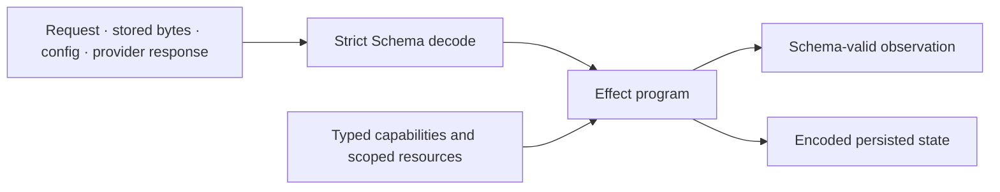
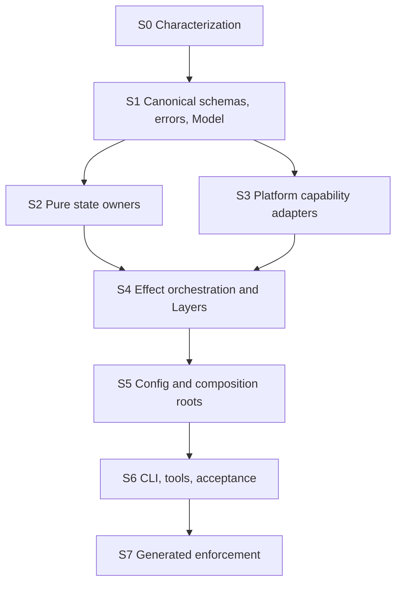

# 0005 — Effect v4 application language

## Goal

A maintainer can follow one dependency graph from an untrusted input or platform capability through a typed Effect program to a schema-valid observation or persisted artifact. Invalid state must fail at the boundary; authority, interruption, retry, cleanup, and concurrency must remain visible in the Effect type or Layer graph.

This migration fixes the boundary and lifecycle defects found by the 2026-08-10 audit. It is not a syntax rewrite.

## Decisions

| Concern | Required representation | Deliberate plain-TypeScript boundary |
| --- | --- | --- |
| External or persisted data | Effect `Schema`; strict excess-property rejection | Raw `unknown` exists only as the immediate decoder input |
| Records with distinct internal/public or create/update/select projections | Effect `Model` | Whole-document Durable Object snapshots stay Schema models |
| Fallible or dependency-bearing application logic | `Effect.Effect<Success, Error, Requirements>` | Total deterministic functions remain plain |
| Capabilities | `Context.Service` plus `Layer` | Cloudflare/Bun SDK objects stay inside adapter Layers |
| Configuration | Effect `Config` with schema validation and redacted secrets | Platform env/binding extraction occurs once at the composition root |
| Expected failures | Schema-backed tagged errors in the Effect error channel | Native exceptions are caught at the platform edge and translated once |
| Time, randomness, cryptography | Effect `Clock`/`Crypto` or an explicit capability | Pure code receives already-produced values |
| Resource lifetime | `Scope`, `acquireUseRelease`, or one explicit owner | WebSocket event forwarding remains a platform callback |
| Retry | Explicit `Schedule` or durable retry state interpreted by an Effect program | Cloudflare alarm delivery remains a platform callback |
| Concurrency | One actor/owner, `Ref`/`Deferred`/mutex, or durable transaction | Parallel pure calculations need no Effect wrapper |
| Program execution | One `Effect.run*` at each CLI, Worker, Durable Object, script, or acceptance root | No nested execution inside services or loops |

## Semantic boundary

The diagram is the allowed direction. No service receives a cast value from the left or reaches ambient authority around the capability edge.

## Invariants

| ID | Requirement | Enforcer after migration |
| --- | --- | --- |
| F1 | Missing or malformed Git verification fields cannot authorize publication. | Strict transport response schemas plus negative repository tests |
| F2 | A Session preserves every valid JSON message without coercion. | `Schema.Json` message type plus send/observe round-trip test |
| F3 | A Durable Object never treats generic storage typing as validation. | Versioned Session, Project Memory, and Environment snapshot decoders on load and save |
| F4 | Project Memory cannot expose session attribution in its public proposal projection. | One Effect Model with a sensitive internal field plus JSON projection fitness test |
| F5 | Expected failures leave services through a closed tagged error union. | Schema-backed error algebra, exhaustive mapping, and Effect-tsgo diagnostics |
| F6 | A failed Project Memory write cannot advance the in-memory authoritative revision. | Persist-before-publish ordering plus failed-write test |
| F7 | Checkpointing cannot begin while an accepted connection or turn is active. | One lifecycle drain owner plus active-operation test |
| F8 | Public Environment commands belong to the canonical command union and have idempotency identity. | Protocol command schema plus router/DO decoding |
| F9 | A failed final checkpoint retains the `Failed` tombstone required by design 0003 while cleanup is retried idempotently. | Environment transition test bound to design 0003 §Failure behavior |
| F10 | Configuration failure occurs before request routing or provider mutation. | Config schema and root Layer construction |
| F11 | Secrets cannot enter normal strings or public error envelopes. | `Config.redacted`, redacted public errors, and response tests |
| F12 | Mutable asynchronous resources have one owner. | Scoped Layers or serialized owners for Sandbox, publication, and profile registration |
| F13 | Native Promise control flow and ambient authority exist only in named adapters and final roots. | Generated Oxlint domain policy plus suppression audit |
| F14 | Pure computations are not wrapped merely to increase Effect usage. | Architecture boundary map and module review |

## Audit defects in scope

1. Repository verification defaults missing `changedPaths` to `[]`; ref updates default a missing acknowledgement to the requested SHA.
2. Session and Project Memory snapshots are unchecked structural interfaces loaded with generic storage casts.
3. Cloud-task Send declares `Schema.Json` but coerces values with `String`.
4. Service Layers return values through `as never` and collapse typed failures.
5. The public `CheckpointEnvironment` branch is absent from the canonical command contract and has no command receipt.
6. Final checkpoint failure behavior contradicts approved design 0003.
7. `TimestampSchema` accepts impossible instants; paired-trial equality depends on object insertion order.
8. Worker configuration is duplicated as optional/raw interfaces and read at request time; a missing credential binding can fall back to ambient fetch.
9. Lifecycle/application orchestration lives in the Cloudflare adapter package as native Promise code while `packages/runtime` contains only Effect declarations.
10. CLI, MCP, control-plane, audit scripts, and acceptance roots contain manual JSON, native control flow, or ambient capabilities outside enforceable Effect domains.
11. Runtime version facts are duplicated between package manifests, Alchemy, Dockerfile, scaffold metadata, and design claims.
12. Current lint domains omit active trees and include packages that do not exist.

## Implementation dependency graph

Each slice below is an executable agent contract. A writer remains bound to this specification and may not weaken a failing boundary to make its slice pass.

### S0 — Characterize the contracts

**Targets:** protocol tests; Cloudflare repository, Session, Project Memory, Environment, and service tests; CLI/MCP/control-plane tests.

**Change:** Add focused tests for impossible timestamps, semantically equal reordered trial JSON, structured Send values, corrupt stored snapshots, malformed Git verification/update responses, failed Project Memory persistence, typed error mapping, active checkpoint drain, command decoding, redacted public failures, and design-0003 final checkpoint semantics.

**Acceptance:** Every test fails for the intended pre-migration defect and protects an observable contract rather than source text.

### S1 — Canonical representations

**Targets:** `packages/protocol`; boundary schemas in `packages/runtime`; internal persistence schemas next to their semantic owners.

**Change:** Strengthen Timestamp; use Schema equivalence/canonicalization for trial values; add versioned discriminated Session and Project Memory snapshots; add Git, broker, Sandbox, memory-route, and Environment command/response schemas; add a closed tagged error algebra. Introduce one Project Memory proposal `Model` whose sensitive `sessionId` is absent from the public JSON projection. Keep genuinely extensible message/event/measure payloads as `Schema.Json`.

**Acceptance:** No boundary model uses open `Record<string, unknown>` state. Unknown values are decoded once. Model fitness proves encoded/create/update/select/public variants where used.

### S2 — Pure state owners

**Targets:** Session and Project Memory transitions; profile classification; repository path/ref calculations; Environment transition decisions.

**Change:** Keep total transitions plain. Accept branded/schema-warranted inputs, inject produced time/IDs, preserve JSON messages, return schema-valid outputs, make lifecycle variants unrepresentable, and commit in-memory memory state only after persistence succeeds.

**Acceptance:** No `as never`, terminal cast, dynamic post-decode field lookup, or invalid lifecycle combination remains in these modules.

### S3 — Platform capability adapters

**Targets:** Durable Object storage, Fetcher Git/broker/provider calls, KV, R2, Sandbox, WebSocket, Bun filesystem/process/stdio, and HTTP clients.

**Change:** Keep platform signatures narrow and imperative. Decode every response immediately, translate native rejection into one typed adapter error, bound payload/concurrency where required, and expose Effects or Layers to application code. Missing Git fields fail closed. Public errors use stable redacted reasons.

**Acceptance:** Platform adapters contain all remaining direct SDK/native Promise calls; their callers receive typed Effects and decoded values only.

### S4 — Effect orchestration and ownership

**Targets:** `packages/runtime` implementations and Cloudflare lifecycle/application programs.

**Change:** Move dependency-bearing Session, memory, repository, cache, Sandbox, credential, and Environment orchestration behind `Context.Service` contracts. Use `Effect.gen`/`Effect.fn`, precise error channels, `Scope` for cleanup, `Clock`/`Crypto`, explicit `Schedule`, and one serialized owner for mutable resources. Durable Object callbacks run/provide the program once; WebSocket events remain callbacks that notify the owner.

**Acceptance:** Application services contain no native Promise control flow, ambient Date/crypto/fetch, broad catch-and-ignore cleanup, or nested `Effect.run*`.

### S5 — Config and composition roots

**Targets:** Worker env, control-plane root, CLI root, `infra/alchemy.run.ts`, and design 0004 deployment command.

**Change:** Define one schema-validated configuration per executable; use `Config.redacted` for secrets; construct Layers once; remove request-time optional reads and global fallbacks. Generate runtime version bindings from one package/config authority used by Docker and Alchemy. Preserve SecretSpec as the command-scoped provider described by design 0004.

**Acceptance:** Missing/invalid config fails before routing or provider mutation. No product module reads `process.env`, `Bun.env`, or optional Worker config outside its root adapter.

### S6 — CLI, tooling, and acceptance

**Targets:** CLI command/client/MCP, control-plane routing, audit scripts, acceptance report/local roots.

**Change:** Replace raw JSON with Schema codecs, manual RPC duplication with generated/schema-bound metadata, inner run loops with one Effect program, and unbounded `Promise.all` with bounded Effect concurrency. Keep rendering, statistics, matching, and other total leaves plain.

**Acceptance:** Each executable has one run boundary, typed failures, schema-valid input/output, and deterministic exit/error behavior.

### S7 — Enforcement and removal

**Targets:** generated Oxlint domains, Effect-tsgo settings, import/config/source audits, hooks/full check, obsolete helpers and dependencies.

**Change:** Generate file-level roles from the architecture source; enable applicable Effect rules, type-aware diagnostics, and native-disable suppression auditing. Remove phantom paths, duplicate hash/time/id/json helpers, `as never`, stale interfaces, and unexplained dependencies only after callers migrate.

**Acceptance:** A source audit proves prohibited constructs exist only in explicit adapters/roots. `bun run check` passes from a clean exact tree.

## Non-goals

- Wrapping total pure functions, Schema declarations, or platform callbacks in decorative Effects.
- Moving Durable Object/R2 whole-document state to SQL solely to justify Effect Model.
- Replacing Cloudflare, T3Code, GitHub, SecretSpec, SOPS, or Alchemy.
- Broadening public payloads beyond the approved product contracts.
- Deploying or mutating provider state as part of the refactor.
- Preserving compatibility aliases, dual APIs, or unchecked legacy paths after their callers migrate.

## Falsifiers / definition of done

The migration is rejected if any item fails:

1. Object, array, boolean, number, string, and null Send values round-trip unchanged.
2. Missing or malformed Git `changedPaths`, ancestry, commit metadata, or ref acknowledgement is rejected before a receipt.
3. Corrupt Session/Memory storage is a typed quarantine/migration failure, never accepted state.
4. Project Memory public proposal encoding cannot contain `sessionId`.
5. Impossible timestamps are rejected; semantically equal reordered trial JSON is accepted.
6. A failed memory write leaves the previously durable in-memory revision active.
7. Checkpoint waits for drain; a failed final capture retains the required `Failed` tombstone and cleanup evidence.
8. Public command, response, and error envelopes strict-decode and expose no arbitrary provider message.
9. Service interfaces contain no unsupported `unknown`, unchecked cast, or generic dynamic record after decoding.
10. Effect requirements expose every capability; only explicit adapters/final roots use ambient platform APIs or native Promise signatures.
11. Every executable constructs validated Config and Layers before work begins.
12. Generated enforcement rejects a representative ambient authority, raw JSON parse, native Promise control flow, untyped throw, nested run, and native suppression in a protected domain.
13. Focused tests, type diagnostics, lint, source audits, builds, and the repository full check pass.
